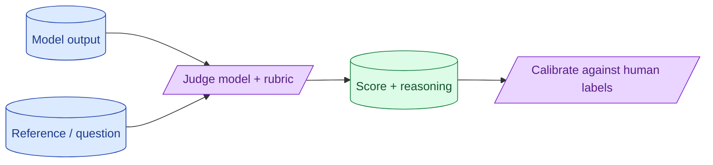

When rules cannot answer 'is this answer good?', a model can. LLM-as-judge is one prompt scoring another model's output. Done well it correlates with human judgement. Done poorly it produces correlated bias and a false sense of progress. The judge is its own product and needs its own evaluation.

**What this page will cover.**

- When to reach for a judge vs rules
- Picking a judge model: bigger than the system under test
- Rubric design: clear criteria, calibration examples
- Calibrating judge agreement against human labels
- Known biases (position, length, self-preference)

*Page coming soon.*

This concept sits in **Stage 5 (Evaluation)** of the [AI Engineering Roadmap](/practice/ai-engineering/roadmap/).
