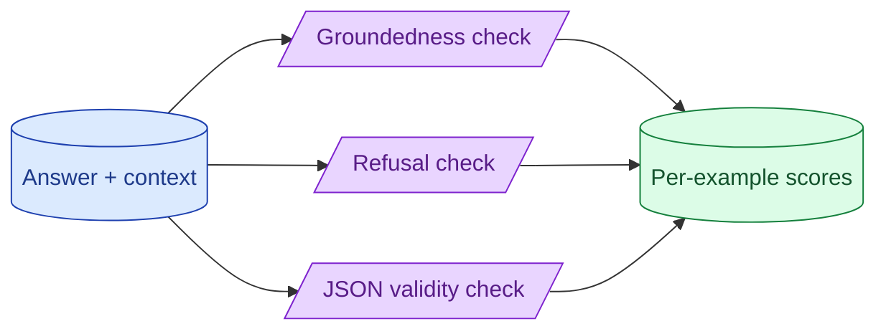

You do not always have a reference answer. You can still evaluate. Groundedness asks 'is the answer supported by the retrieved context?' Refusal correctness asks 'should the model have refused?' JSON validity asks 'is this parseable?' These checks scale because they need no labels.

**What this page will cover.**

- What reference-free evals are good for
- Groundedness: the most useful RAG eval that needs no labels
- Refusal correctness as a real safety metric
- JSON / schema validity as a continuous signal
- Combining reference-free checks into a quality dashboard

*Page coming soon.*

This concept sits in **Stage 5 (Evaluation)** of the [AI Engineering Roadmap](/practice/ai-engineering/roadmap/).
