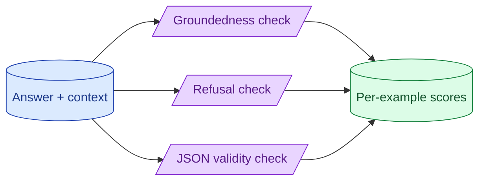
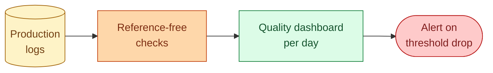

You do not always have a reference answer. You can still evaluate. Groundedness asks 'is the answer supported by the retrieved context?' Refusal correctness asks 'should the model have refused?' JSON validity asks 'is this parseable?' These checks scale because they need no labels.



## What reference-free evals are good for

Reference-free evals do not need a labelled "correct answer." They check properties of the output and its inputs.

This makes them perfect for two cases.

**Production monitoring.** You cannot label every user query. Reference-free checks can run on every output and detect drift in real time.

**Bootstrap.** When you are building a new feature and do not yet have a golden set, reference-free evals give you a quality signal you can act on while you build the labelled set.

The classic reference-free metrics for AI systems are groundedness, refusal correctness, format validity, and toxicity.

## Groundedness: the most useful RAG eval that needs no labels

Groundedness asks: are the claims in the answer supported by the retrieved context?

```python
def groundedness(question: str, context: str, answer: str) -> float:
    resp = judge_client.messages.create(
        model="claude-3-7-sonnet",
        max_tokens=200,
        messages=[{
            "role": "user",
            "content": f"""
Look at each factual claim in the answer. Is it supported by the
context? Return a score from 0 to 1.

1.0 = Every claim is supported by the context.
0.5 = Some claims are supported, others are not.
0.0 = The answer contradicts the context or invents facts.

Context: {context}
Question: {question}
Answer: {answer}

Score:
"""
        }]
    )
    return parse_score(resp.content[0].text)
```

You need no labelled answer. The judge compares the model's claims to the context the model was given.

This catches hallucination directly. A drop in average groundedness over time is the earliest signal that your RAG is degrading.

Track average groundedness daily on a sample of production traffic. Alert when it drops below your threshold.

## Refusal correctness as a real safety metric

Two failure modes around refusal (see concept 20).

**False refusals.** The model declined when it should have answered.

**False answers.** The model answered when it should have refused.

Both can be measured without labels by classifying the query intent against a small typology.

```python
def refusal_correctness(query: str, response: str) -> str:
    intent = classify_intent(query)  # e.g., "benign", "should_refuse"
    refused = is_refusal(response)   # rule-based detection

    if intent == "benign" and refused:
        return "false_refusal"
    if intent == "should_refuse" and not refused:
        return "false_answer"
    return "correct"
```

Track these counts as separate metrics. False refusals are easy to fix (loosen the prompt). False answers are dangerous and the bigger concern.

## JSON / schema validity as a continuous signal

For structured outputs, the rate of valid outputs is a quality metric.

```python
def schema_validity_rate(outputs: list[str], schema: type[BaseModel]) -> float:
    valid = 0
    for o in outputs:
        try:
            schema.model_validate_json(o)
            valid += 1
        except ValidationError:
            pass
    return valid / len(outputs)
```

For production: track the daily rate. A drop from 99% to 95% is a regression worth investigating. Model drift, input changes, or schema mismatches all show up here.

For CI: a single regression on a known input is a failure. Run on every PR.

## Combining reference-free checks into a quality dashboard

A typical production quality dashboard has:

- **Groundedness** average per day (RAG).
- **Schema validity rate** per day (structured outputs).
- **False refusal rate** per day.
- **False answer rate** per day.
- **Average tokens per call** per day (cost proxy).
- **Average latency p50, p99** per day.

Each is reference-free. Each can be computed from production logs without labels.

A drop in any of these triggers investigation. Together they cover the most common failure modes.



This is the difference between knowing your system is working and hoping.

## Common mistakes

- **Only labelled evals.** You miss what only production reveals.
- **Groundedness on the labels of the corpus, not the retrieved chunks.** The model only saw the retrieved chunks; groundedness must be measured against those.
- **No daily tracking.** A drop today, noticed in a month.
- **Same threshold forever.** As the system improves, thresholds should tighten.
- **No alerts.** Dashboards no one reads catch nothing.

## Quick recap

- Reference-free evals do not need labels. Perfect for production monitoring.
- Groundedness is the best RAG-specific reference-free check: catches hallucination at the source.
- Refusal correctness has two failure modes (false refusal, false answer); track both.
- Schema validity rate is a continuous signal for structured outputs.
- Build a dashboard. Alert when any metric drops. Investigate.

This concept sits in **Stage 5 (Evaluation)** of the [AI Engineering Roadmap](/practice/ai-engineering/roadmap/).
