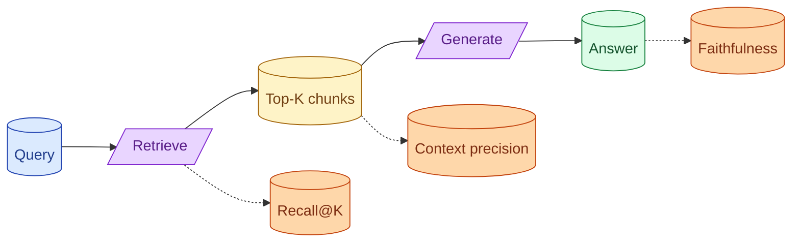

A RAG system can fail at retrieval, generation, or both. The eval suite has to separate them. Recall@K asks if retrieval found the right chunk. Faithfulness asks if generation stuck to the retrieved context. Context precision asks if the retrieved chunks were actually relevant. Without these three you cannot debug RAG.



## The three RAG metrics and why you need all of them

**Recall@K.** Of all the queries, what fraction had the right chunk in the top K retrieved? Measures retrieval coverage.

**Context precision.** Of the K retrieved chunks, what fraction was actually relevant to the query? Measures retrieval precision.

**Faithfulness.** Of the claims in the generated answer, what fraction is supported by the retrieved chunks? Measures generation honesty.

Each one points to a different fix. If recall@K is low, retrieval is missing things; investigate embedding, chunking, or hybrid search. If context precision is low, retrieval is bringing junk; tune ranking or reduce K. If faithfulness is low, the model is hallucinating despite good context; tighten the prompt or add citation requirements.

Without all three, "RAG is bad" gives you nowhere to start.

## Separating retrieval failures from generation failures

The most useful debugging move in RAG: classify every failure as retrieval-side or generation-side.

```python
def diagnose(query: str, retrieved: list[Chunk], answer: str, ground_truth: dict) -> str:
    correct_chunk_in_top_k = any(c.id in ground_truth["chunk_ids"] for c in retrieved)
    answer_grounded = check_faithfulness(answer, retrieved)
    answer_correct = check_correctness(answer, ground_truth["answer"])

    if not correct_chunk_in_top_k:
        return "retrieval_failure"  # the right chunk was not retrieved
    if not answer_grounded:
        return "hallucination"  # right chunks were there, model ignored them
    if not answer_correct:
        return "generation_failure"  # right context, wrong answer
    return "ok"
```

For each failure, you know which side caused it. The fix is targeted.

Most teams discover that 60-70% of their RAG failures are retrieval-side. They have been tuning prompts when they should have been improving chunking and embeddings.

## Building a retrieval golden set vs an answer golden set

Two complementary datasets.

**Retrieval golden set.** Queries with the IDs of the chunks that should be retrieved.

```json
{
  "query": "What is the refund window?",
  "correct_chunk_ids": ["doc_42_chunk_3", "doc_42_chunk_4"]
}
```

This eval is fast (no LLM call) and measures recall@K and context precision.

**Answer golden set.** Queries with expected answer content.

```json
{
  "query": "What is the refund window?",
  "expected_answer_contains": ["14 days", "annual subscription"],
  "expected_facts": ["Refund window is 14 days for annual plans."]
}
```

This eval measures faithfulness and answer correctness. Slower (LLM call) but tests the whole pipeline.

Build both. The retrieval set is the more important debugging tool; the answer set is what tells you whether the system is producing right answers.

## Context precision as the early warning for chunking problems

Context precision is the under-used RAG metric.

If precision is low (most retrieved chunks are irrelevant), the model has to find the needle in noise. Even good models do worse with worse context.

Causes of low precision:

- Chunks too big (each chunk covers too many topics; only part is relevant).
- Chunks too generic (no specific signal to match against).
- Bad embeddings (semantically related but irrelevant chunks show up).
- K too large (the top 3 are good; chunks 4-10 are noise).

Low precision is also a signal you do not need a bigger K. You need a better K.

Track context precision weekly. A drop suggests retrieval is broadcasting more than searching.

## Hooking the metrics into CI so regressions block merges

For each PR that touches retrieval, prompt, or model config:

```yaml
- name: RAG eval suite
  run: |
    python -m evals.rag --golden retrieval_golden_v1.jsonl
    python -m evals.rag --golden answer_golden_v1.jsonl
- name: Fail on regression
  run: |
    python -m evals.compare --base main --threshold 0.05
```

If recall@5 drops by more than 5 percentage points, the build fails. The team sees the regression before merge.

Tune thresholds per metric. Recall@K matters more than answer correctness for many systems. Set the bar accordingly.

## A practical eval cadence

For a working RAG team:

**Per PR (CI).** Run the eval suite on a small fixed sample (50-100 cases). Fast feedback. Catches obvious regressions.

**Nightly.** Run the full eval suite (1000+ cases). Catches subtler issues.

**Weekly.** Sample 200 production queries. Run reference-free evals (groundedness, refusal correctness). Compare to last week.

**Per incident.** Add the failing case to the golden set so it cannot regress again.

This cadence catches most regressions before they reach users.

## Common mistakes

- **Only measuring answer quality.** You cannot tell whether retrieval or generation is the problem.
- **No retrieval golden set.** You spend weeks tuning prompts when chunking is the issue.
- **Static metrics.** As the system improves, raise the thresholds. Otherwise you stop measuring improvement.
- **Skipping context precision.** Hides chunking problems for months.
- **No incident-driven set growth.** Bugs that shipped before ship again.

## Quick recap

- Three RAG metrics: recall@K, context precision, faithfulness. Each points to a different fix.
- Classify every failure as retrieval-side or generation-side. Most failures are retrieval-side.
- Two golden sets: retrieval (query + correct chunks) and answer (query + correct answer).
- Context precision is the early warning for chunking problems.
- Run in CI, fail builds on regression. Grow the set from incidents.

This concept sits in **Stage 5 (Evaluation)** of the [AI Engineering Roadmap](/practice/ai-engineering/roadmap/).
