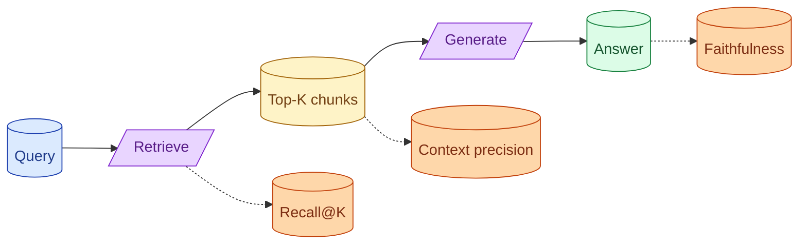

A RAG system can fail at retrieval, generation, or both. The eval suite has to separate them. Recall@K asks if retrieval found the right chunk. Faithfulness asks if generation stuck to the retrieved context. Context precision asks if the retrieved chunks were actually relevant. Without these three you cannot debug RAG.

**What this page will cover.**

- The three RAG metrics and why you need all of them
- Separating retrieval failures from generation failures
- Building a retrieval golden set vs an answer golden set
- Context precision as the early warning for chunking problems
- Hooking the metrics into CI so regressions block merges

*Page coming soon.*

This concept sits in **Stage 5 (Evaluation)** of the [AI Engineering Roadmap](/practice/ai-engineering/roadmap/).
