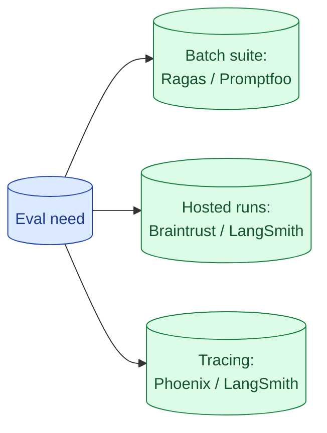

The eval tooling space changed twice in 2025 and will change again. The honest map: Ragas for RAG metrics, Promptfoo for prompt sweeps and CI, Braintrust and LangSmith for hosted runs, Phoenix for open-source tracing. Pick one for batch evals and one for tracing; everything else is optional.



## What each tool is genuinely good at

**Ragas.** Open source. Pre-built RAG metrics (faithfulness, answer relevance, context precision, recall). Pip install, point at your data, get scores. Best for teams that have a RAG and want the standard metrics fast.

**Promptfoo.** Open source. YAML-driven prompt sweeps. Run a prompt with 20 variations on 50 inputs, compare outputs side by side. Best for prompt iteration and CI.

**Braintrust.** Hosted. Polished UI for managing experiments, golden sets, judges. Strong on team collaboration. Best for teams that want a managed dashboard and version history.

**LangSmith.** Hosted, from the LangChain team. Combines tracing, evaluation, and prompt management. Best if you already use LangChain or want one tool for tracing plus eval.

**Phoenix.** Open source, from Arize. Strong on observability and tracing, with eval support. Best for teams wanting open-source tracing they can self-host.

## Batch suite vs hosted vs tracing as orthogonal needs

Three different jobs that get conflated.

**Batch suite.** Run a set of evals on a golden dataset, get scores. CI candidate. Ragas, Promptfoo, your own scripts.

**Hosted experiment tracking.** A UI to see runs, compare versions, share results. Braintrust, LangSmith. Useful for teams.

**Tracing.** Capture every LLM call with its inputs, outputs, timing, cost. Production observability. Phoenix, LangSmith, OpenTelemetry-based custom.

You need all three for a mature setup. They are orthogonal. Pick one tool for each job.

A common pattern: Ragas (or Promptfoo) for batch in CI + LangSmith (or Phoenix) for tracing in prod.

## Open-source vs hosted: where to draw the line

Open-source tooling lets you self-host, control your data, avoid vendor lock-in. The cost is operational: you run the tool, manage upgrades, deal with bugs.

Hosted tooling is fast to set up, gives you a polished UI, but ties you to a vendor and may ship your eval data to their servers.

The honest decision points:

- **PII or compliance concerns.** Self-host. Period.
- **Small team, fast iteration matters more than tooling.** Hosted.
- **Big team, prompt history is the institutional memory.** Hosted (managed history matters).
- **You want git-based prompt management.** Either; tools have improved on this.

In 2026 the gap between hosted and open-source has narrowed. Either is viable for most teams.

## Integrating with CI: what to fail builds on

Two patterns.

**Hard threshold.** Fail the build if any metric drops below a hard number. Recall@5 below 75%, fail.

**Regression threshold.** Fail the build if any metric drops by more than X% from the main branch baseline. Catches regressions without forcing a fixed quality bar.

Most teams use the second. It allows quality to vary over time but catches sudden drops.

```yaml
- name: Run eval suite
  run: python -m evals.run

- name: Compare against main
  run: python -m evals.compare --base main --max-drop 0.05
  # fails if any metric drops by more than 5 percentage points
```

Also: fail the build on any case that has previously failed (regressions). New failures are reviewed; old failures must be fixed.

## Migrating between tools without re-curating your golden set

The biggest pain in switching eval tools is the golden set. If it lives in Tool A's proprietary format, migration is a rewrite.

The senior pattern: store the golden set in a tool-neutral format (JSONL in git). Each tool has a thin adapter that loads from your format.

```python
def load_golden_set(path: str) -> list[EvalCase]:
    with open(path) as f:
        return [EvalCase.parse_raw(line) for line in f]

# Use with any tool
ragas.evaluate(load_golden_set("evals/rag.jsonl"))
promptfoo.run(load_golden_set("evals/rag.jsonl"))
braintrust.upload(load_golden_set("evals/rag.jsonl"))
```

Your golden set is yours. The tooling is replaceable.

## A practical setup for a small team

```
evals/
  rag_qa.jsonl                # golden set, source of truth
  classify_ticket.jsonl
  scripts/
    run_rag.py                # uses Ragas under the hood
    run_classify.py           # uses our own rule-based checks
    ci_compare.py             # fails build on regression
```

Plus:

- Phoenix self-hosted on a small box for production tracing.
- A weekly review of the dashboards and incident set growth.

Total tooling cost: a small infra bill plus engineering time. No SaaS lock-in. Migrations are local edits.

For larger teams, swap Phoenix for LangSmith if the polished UI is worth the spend.

## Common mistakes

- **Picking a tool because it is popular.** Tools change every 6 months. Pick based on your needs.
- **Wrapping your golden set in a tool's format.** Migration becomes painful.
- **Using a hosted tool for sensitive data without checking data residency.** Compliance issue.
- **Mixing tracing and batch eval into one tool because it claims to do both.** Often does one well, the other poorly.
- **No CI integration.** The tool runs locally; regressions still ship.

## Quick recap

- Three orthogonal jobs: batch suite, hosted tracking, tracing. Pick one tool per job.
- Open source viable in 2026: Ragas, Promptfoo, Phoenix. Hosted: Braintrust, LangSmith.
- Store golden set in tool-neutral format (JSONL in git). Switch tools without rewriting.
- CI fails on regression against main, not on hard thresholds (usually).
- For a small team: Ragas + Phoenix is a strong starting setup.

This concept sits in **Stage 5 (Evaluation)** of the [AI Engineering Roadmap](/practice/ai-engineering/roadmap/).
