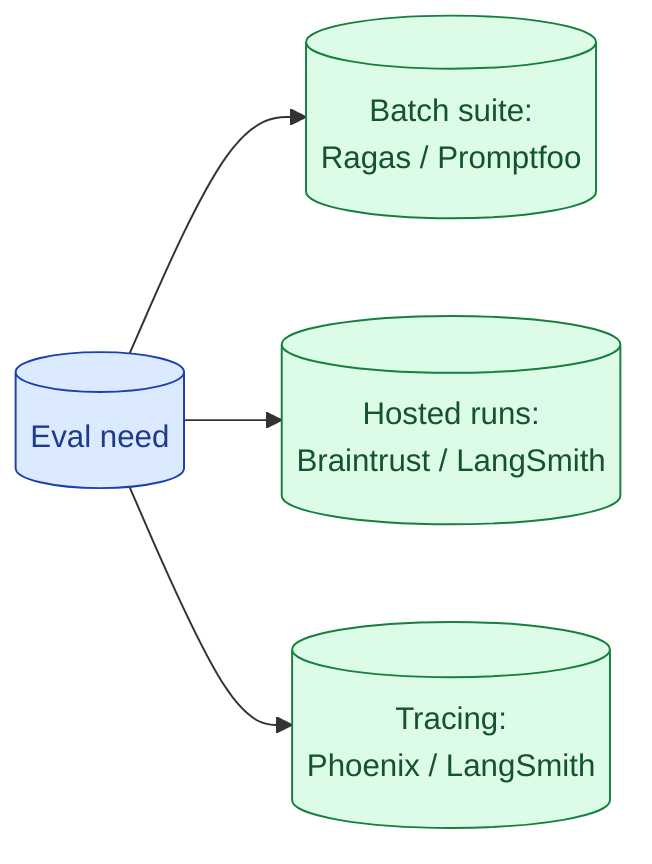

The eval tooling space changed twice in 2025 and will change again. The honest map: Ragas for RAG metrics, Promptfoo for prompt sweeps and CI, Braintrust and LangSmith for hosted runs, Phoenix for open-source tracing. Pick one for batch evals and one for tracing; everything else is optional.

**What this page will cover.**

- What each tool is genuinely good at
- Batch suite vs hosted vs tracing as orthogonal needs
- Open-source vs hosted: where to draw the line
- Integrating with CI: what to fail builds on
- Migrating between tools without re-curating your golden set

*Page coming soon.*

This concept sits in **Stage 5 (Evaluation)** of the [AI Engineering Roadmap](/practice/ai-engineering/roadmap/).
