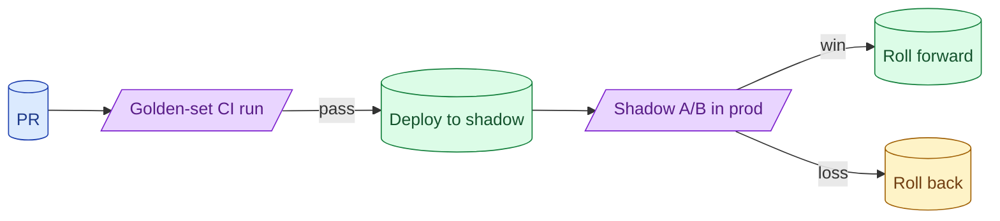

Two eval moments matter: CI before merge and A/B in production after deploy. CI catches regressions on the golden set. A/B catches what the golden set missed. Without both, every release is a guess. With both, prompt changes feel like normal code changes.

**What this page will cover.**

- What to fail the CI build on
- Shadow traffic: comparing old and new without user impact
- Online A/B for LLM outputs: what metrics actually move
- Rollback as a first-class operation
- Closing the loop: production fails become golden-set entries

*Page coming soon.*

This concept sits in **Stage 5 (Evaluation)** of the [AI Engineering Roadmap](/practice/ai-engineering/roadmap/).
