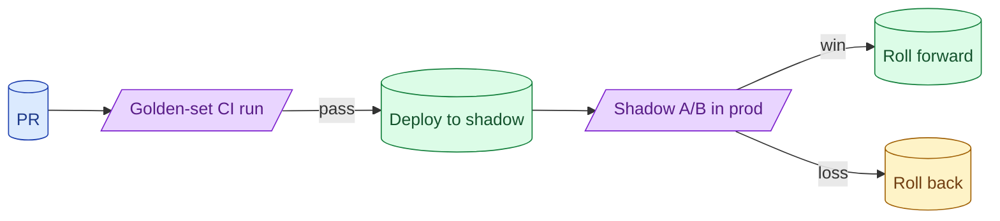
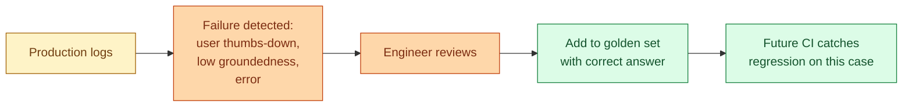

Two eval moments matter: CI before merge and A/B in production after deploy. CI catches regressions on the golden set. A/B catches what the golden set missed. Without both, every release is a guess. With both, prompt changes feel like normal code changes.



## What to fail the CI build on

Three categories of failure earn a build block.

**Hard schema failures.** A structured output PR drops the validity rate below 99%. Real bug; block.

**Regression on the golden set.** A prompt PR drops recall@5 by 5+ percentage points. Real bug; block.

**Previously-fixed cases regress.** A case that has been passing for months now fails. Block; either the fix was wrong or the new change broke it.

Things that should NOT block by default:

- Small score changes (under 2-3 points) on noisy metrics.
- New cases the team has not labelled yet.
- Judge model disagreement (run the judge multiple times for stability).

The build block exists to catch real regressions. False positives erode the team's trust in the suite.

## Shadow traffic: comparing old and new without user impact

After CI passes, the next gate is shadow traffic. Both the old and new prompt run on real user queries; only the old version's output reaches the user. The new version's output is logged for analysis.

```python
def handle_request(query: str) -> str:
    primary_output = call_old_prompt(query)
    shadow_output = call_new_prompt(query)
    log_shadow(query, primary_output, shadow_output)
    return primary_output  # user only sees the primary
```

After a day or week of shadow, you have hundreds or thousands of paired outputs. Compare:

- Did the new version produce more groundedness errors?
- Did latency get worse?
- Did refusal rate change?
- For sampled outputs, did a judge model prefer the new or the old?

Shadow lets you catch regressions the golden set missed without putting users at risk.

## Online A/B for LLM outputs: what metrics actually move

Once shadow looks promising, expose to a fraction of users (5%, then 25%, then 50%, then 100%).

The metrics that actually move:

- **Conversion or completion rate.** Did the user complete the task? Strongest signal.
- **Latency p99.** A 200ms increase from streaming changes is fine; 2 seconds is bad.
- **Cost per request.** A token-savings change should show up here.
- **User feedback (thumbs up/down).** Direct quality signal, slow to accumulate.
- **Refusal rate.** A jump usually means the new prompt is over-restrictive.
- **Error rate.** Schema failures, timeouts, retries.

The metrics that often do not move (despite expectations):

- Average tokens per response. Slight changes hide in the noise.
- Judge scores. Hard to detect statistically without large samples.

Plan A/Bs around metrics that move. Statistical significance on slow-moving metrics needs huge samples.

## Rollback as a first-class operation

A prompt rollback should be one PR, one minute.

```yaml
# config/prompts.yml
classify_ticket:
  version: v3   # change to v2 to roll back
  rollback_v2: enabled
```

The deploy pipeline reads this config. Rolling back from v3 to v2 is a config change, not a code rollback.

Practice rollbacks. The first time you do it under fire should not be the first time you do it at all. A quarterly drill where someone rolls back a non-critical feature builds muscle memory.

The fastest rollback is no rollback: ship behind a feature flag, kill the flag if needed.

## Closing the loop: production fails become golden-set entries

The cycle that keeps the eval suite useful.



Every production failure that is real (not a flaky one-off) gets added to the golden set. The eval suite grows where the system is weakest.

After a year of this, the golden set covers the failure modes the team has seen. New PRs are tested against the full history. Regressions on past bugs become impossible.

The team that does not close this loop ships the same bug twice.

## A cadence that works

For a team shipping prompt changes regularly:

- **Per PR.** Run rule-based + lightweight judge evals on the golden set. ~5 minutes. Fail on regression.
- **Per deploy.** Shadow the new version against the old on production traffic for 24 hours. Compare.
- **Per A/B rollout.** Slow rollout (5%, 25%, 100%) with metrics monitoring at each step. Bail on regression.
- **Weekly.** Review production failures. Add new entries to the golden set.
- **Quarterly.** Prune the golden set; review thresholds; consider new metrics.

This cadence converts AI engineering from "ship and pray" to "ship and verify."

## Common mistakes

- **CI on a tiny golden set.** Misses too much.
- **No shadow phase.** Real users find regressions you cannot anticipate.
- **A/B on unstable metrics.** Statistical noise > real signal. Pick metrics that move.
- **Hard rollback through a code change.** Slow when it matters most.
- **Production failures never feed back to evals.** Bugs repeat.

## Quick recap

- Two eval moments: CI on the golden set before merge, A/B in production after deploy.
- Fail CI on schema failures, regressions, and previously-fixed cases.
- Shadow new versions against old in production; compare without user impact.
- A/B on metrics that actually move (conversion, latency, cost, error rate).
- Rollbacks should be config changes, not code rewrites.
- Every production failure becomes a golden-set entry. The cycle grows the suite.

This concept sits in **Stage 5 (Evaluation)** of the [AI Engineering Roadmap](/practice/ai-engineering/roadmap/).
