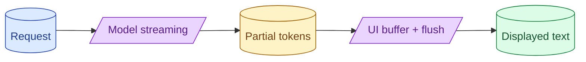

Streaming is a UX feature, not just a backend feature. The decisions are when to start showing tokens, how to render partial output, what to do on cancellation, and how to handle JSON or tool calls that need to be complete before they make sense. Done well it feels instant. Done badly it flickers.



## When to start the stream vs wait for first sentence

The default reflex is to show tokens as they arrive. This is usually right but not always.

Show the first token immediately when:

- The user is in a chat UI watching for a response.
- The model's output is mostly natural language.
- Time-to-first-token is the metric that matters.

Wait briefly (50-200ms) before showing when:

- The first few tokens are often "Sure, here's the..." preamble that you want to strip.
- You want to detect a refusal and switch to a different UI.
- The model's output has a JSON shape that needs the full close brace.

For most chat features, immediate streaming wins. For structured outputs, buffer briefly and decide.

## Smoothing token bursts on the client

Models do not stream at a uniform rate. They produce tokens in bursts: nothing for 200ms, then 30 tokens at once, then another pause.

If you render each batch as it arrives, the text appears in jumps. Two characters, pause, fifteen characters, pause. Hard to read.

The fix is a smoother on the client. Queue arriving tokens, flush them to the UI at a steady rate (60-80 chars per second feels natural).

```javascript
const renderQueue = []
const targetCharsPerSecond = 70

function onToken(token) {
    renderQueue.push(token)
}

setInterval(() => {
    const charsToFlush = targetCharsPerSecond / 30  // 30fps
    let buffer = ""
    while (renderQueue.length && buffer.length < charsToFlush) {
        buffer += renderQueue.shift()
    }
    if (buffer) ui.append(buffer)
}, 33)
```

50 lines, smooth rendering. The streamer never feels like it stutters.

## Cancellation and partial-billing for cut streams

Users cancel responses mid-stream. They hit stop, click a new message, navigate away.

Two backend issues to handle.

**Stop the model call.** Send a cancel to the provider. Most SDKs expose an abort. The provider stops generating; you stop paying for further tokens.

**Bill what was generated.** Tokens that were produced before cancellation are billed. Log them. Your cost tracking should include partial responses.

```python
async def stream_with_cancel(query, cancellation_token):
    stream = client.messages.stream(...)
    async with stream:
        async for token in stream.text_stream:
            if cancellation_token.is_cancelled:
                await stream.aclose()
                break
            yield token
    log_cost(stream.usage)  # includes tokens generated before cancel
```

Without cancellation handling, you generate full responses no one reads.

## Streaming structured output: defer rendering until valid

When the output is JSON, partial JSON is invalid. Showing half a JSON to the user is meaningless.

Pattern: stream into a buffer, render only when valid.

```javascript
let buffer = ""

function onToken(token) {
    buffer += token
    const valid = tryParse(buffer)
    if (valid) {
        ui.renderStructured(valid)
    }
}

function tryParse(text) {
    try {
        return JSON.parse(text)
    } catch (e) {
        return null  // not yet valid
    }
}
```

The UI shows the partial structured output only when it parses. For long structured outputs, you can render fields as they complete using a streaming JSON parser.

For tool calls (which are essentially structured), defer entirely: wait for the call to complete, then dispatch.

## Streaming tool calls without leaking half-built JSON

Models stream tool calls just like text. Each token of the tool call arguments arrives over time.

The wrong move: parse and dispatch as soon as tokens look like a complete call. You will dispatch on half-formed input.

The right move: wait for the explicit "tool call complete" signal from the provider, then parse and dispatch.

Most provider SDKs surface this. Anthropic streams `tool_use_start`, `tool_use_input_delta`, `tool_use_stop` events. You collect deltas, only act on stop.

```python
tool_buffer = ""
async for event in stream:
    if event.type == "tool_use_input_delta":
        tool_buffer += event.delta
    elif event.type == "tool_use_stop":
        args = json.loads(tool_buffer)
        result = await call_tool(args)
        tool_buffer = ""
```

The UI can show "Calling tool X..." while waiting. The actual dispatch happens once.

## A common UX bug: re-rendering the entire response

Some chat UIs append to a string and re-render the full string each token. With 1000 tokens, this is 1000 re-renders of growing strings, each one slower than the last. The UI feels sluggish toward the end of long responses.

The fix: append only the new text to a virtualised text element. The DOM does not re-render the whole response, just the new tail.

React, Vue, and similar frameworks have patterns for this. Use them. Otherwise long responses feel slower as they grow.

## When streaming is the wrong choice

Streaming is not always right.

**Background batch jobs.** No one is watching. Stream nothing; just block.

**Outputs that are unusable until complete.** Long structured JSON, generated code that gets run, an agent loop where each step depends on the previous one's final answer. Block; render when done.

**Sensitive content that needs review.** A moderation check on the full response before showing anything. Block, check, show.

Use streaming for "the user is watching the response." Skip it otherwise.

## Common mistakes

- **Streaming everywhere without thinking about UX.** Sometimes it makes things worse.
- **No smoothing.** Stuttering text feels broken.
- **Not cancelling on user navigation.** Wasted tokens, wasted time.
- **Rendering half a JSON.** Confuses the user.
- **Dispatching tool calls mid-stream.** Half-formed arguments break things.
- **Re-rendering the full response per token.** Long responses feel sluggish.

## Quick recap

- Streaming is half UX. The when and how matter as much as the protocol.
- Smooth token bursts on the client. 60-80 chars per second feels natural.
- Cancel on user navigation. Bill partial responses.
- Defer rendering of structured output until valid.
- Wait for tool-call complete events before dispatching.
- Skip streaming for batch jobs, structured outputs, sensitive content.

This concept sits in **Stage 6 (Production AI systems)** of the [AI Engineering Roadmap](/practice/ai-engineering/roadmap/).
