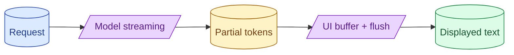

Streaming is a UX feature, not just a backend feature. The decisions are when to start showing tokens, how to render partial output, what to do on cancellation, and how to handle JSON or tool calls that need to be complete before they make sense. Done well it feels instant. Done badly it flickers.

**What this page will cover.**

- When to start the stream vs wait for first sentence
- Smoothing token bursts on the client
- Cancellation and partial-billing for cut streams
- Streaming structured output: defer rendering until valid
- Streaming tool calls without leaking half-built JSON

*Page coming soon.*

This concept sits in **Stage 6 (Production AI systems)** of the [AI Engineering Roadmap](/practice/ai-engineering/roadmap/).
