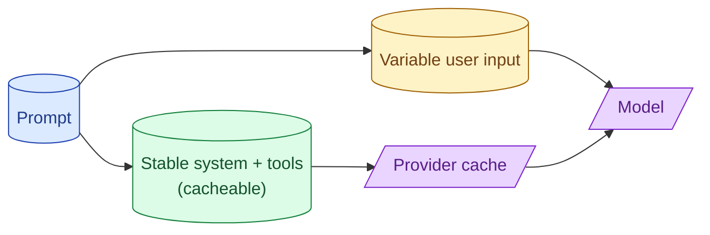

Every major provider caches stable prompt prefixes server-side. A 5000-token system prompt that does not change across calls becomes nearly free after the first hit. The discount is 50% to 90% off the prefix. The catch is the prefix has to be byte-identical and the variable part has to be at the end.

**What this page will cover.**

- How prefix caching works at OpenAI, Anthropic, Google
- Cache hit requirements: byte-identical prefix, minimum length
- Prompt structure for maximum cache hit rate
- Cost math: when caching breaks even vs trimming the prompt
- Measuring cache hit rate as a production metric

*Page coming soon.*

This concept sits in **Stage 6 (Production AI systems)** of the [AI Engineering Roadmap](/practice/ai-engineering/roadmap/).
