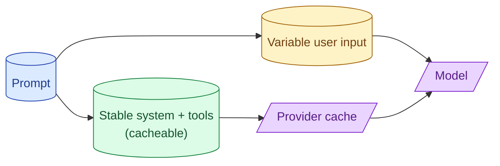

Every major provider caches stable prompt prefixes server-side. A 5000-token system prompt that does not change across calls becomes nearly free after the first hit. The discount is 50% to 90% off the prefix. The catch is the prefix has to be byte-identical and the variable part has to be at the end.



## How prefix caching works at OpenAI, Anthropic, Google

The mechanism is similar across providers. The model has internal state computed from the prompt prefix. If the same prefix arrives again within a TTL, the cached state is reused. The model only has to process the new suffix.

**OpenAI.** Automatic for system prompts over 1024 tokens. The discount is around 50% on cached tokens. TTL is short (5-10 minutes); the cache warms up with traffic.

**Anthropic.** Explicit. You mark sections with `cache_control: {type: "ephemeral"}`. Cached tokens are billed at ~10% of normal input price. TTL is 5 minutes (ephemeral) or 1 hour (extended).

**Google Gemini.** Explicit context caching with longer TTLs (up to days). Different pricing structure; usually best for very stable long contexts.

All three reward stable prefixes. Choose the provider mechanism that fits your prompt structure.

## Cache hit requirements: byte-identical prefix, minimum length

Three constraints govern whether a prefix hits the cache.

**Byte-identical.** Any difference (spaces, timestamps, IDs) breaks the cache. The prefix must be exactly the same on every call.

**Minimum length.** OpenAI requires 1024 tokens, Anthropic requires 1024 tokens for Sonnet/Haiku and 2048 for Opus. Shorter prefixes do not cache.

**Variable part at the end.** The cache works left-to-right. Anything variable has to come after everything cacheable.

```python
# Bad: timestamp in the middle breaks caching
system = f"You are an assistant. Today is {today}. Long stable rules..."

# Good: stable system, variable suffix
system = "You are an assistant. Long stable rules..."
user_message = f"Today is {today}. User question: {q}"
```

The ordering matters. Build prompts deliberately.

## Prompt structure for maximum cache hit rate

A pattern that hits high cache rates:

```
1. Fixed system prompt (cached)
2. Fixed tool definitions (cached)
3. Few-shot examples (cached)
4. Conversation history older than N turns (cached if N is fixed)
5. Recent conversation (not cached)
6. Current user message (not cached)
```

The first three (or four) sections never change between calls for the same feature. The provider caches them. Only the last two sections vary.

The result: a 5000-token prompt with 4500 tokens cacheable. On a 90% cache discount, you pay for 500 tokens + 10% of 4500 = 950 tokens per call instead of 5000. About 80% cost savings on the prefix.

## Cost math: when caching breaks even vs trimming the prompt

Caching helps a lot, but it does not replace prompt trimming. Both are tools.

**Cache is best when:** the prompt has substantial stable content (long system, many tools, few-shot examples). The traffic is high enough that the cache warms (10+ calls per minute, depending on provider).

**Trimming is best when:** the prompt has bloat that does not add value. Even cached, useless tokens cost something.

The math, on a 4000-token system prompt at $3/M tokens:

```
Without caching: 4000 × $3 / 1M = $0.012 per call
With caching (90% off): 400 × $3 / 1M = $0.0012 per call
After trimming to 1500 tokens, no caching: $0.0045 per call
After trimming to 1500 tokens, with caching: $0.00045 per call
```

Best result is "trim then cache." Doing both is usually feasible.

## Measuring cache hit rate as a production metric

Track cache hits in your observability.

```python
log.info("llm_call", extra={
    "prompt_tokens": resp.usage.prompt_tokens,
    "cache_read_tokens": resp.usage.cache_read_input_tokens,
    "cache_creation_tokens": resp.usage.cache_creation_input_tokens,
    "model": model,
    "feature": feature_name
})
```

Most providers expose cache stats in their response. Log them. Build a dashboard.

Target hit rate after warm-up: 70-90% of cacheable tokens. If you are below 50%, something is breaking the cache (timestamp in the prefix, dynamic content, low traffic).

Common reasons cache hit drops:

- Code change that altered a stable section. Prefix is now different.
- User-specific data leaked into the prefix.
- Feature rolled out behind a flag, splitting traffic between two prompt versions.
- Provider TTL expired between calls (low-traffic feature).

The dashboard catches the regression quickly.

## What to cache: priority order

If you have to pick what to mark cacheable (Anthropic-style), prioritise:

1. **Tool definitions.** Often long, always stable.
2. **System prompt.** Usually long, always stable.
3. **Few-shot examples.** Sometimes long, usually stable.
4. **Older conversation history.** Stable once it ages out.

Recent conversation and user input do not benefit; do not bother marking them.

## When the cache does not help

Three situations.

**Low-volume features.** A prompt that runs 5 times an hour will not stay warm. TTL expires between calls.

**Highly variable prompts.** Per-user data, per-call timestamps, per-call retrieved context. Almost nothing is stable.

**Below the minimum length.** Short system prompts (under 1024 tokens) do not cache.

For these, optimise the prompt size directly. Caching is not the lever.

## Common mistakes

- **Timestamp in the system prompt.** Breaks the cache every call.
- **User ID, session ID, or request ID in cacheable section.** Same effect.
- **Forgetting to mark cacheable sections on Anthropic.** Caching is opt-in.
- **Not measuring cache hit rate.** You do not know if it is working.
- **Skipping prompt trimming because "we have caching."** Cached tokens cost something; bloat still costs.

## Quick recap

- All major providers cache stable prompt prefixes. Discount is 50% to 90%.
- Cache requires byte-identical prefix, minimum length (~1024 tokens), variable parts at the end.
- Structure: stable system + tools + few-shot first, variable user message last.
- Combine with prompt trimming for best cost. Both are tools.
- Measure cache hit rate. Target 70-90% after warm-up. Drops signal regression.
- Low-volume features and short prompts do not benefit from caching.

This concept sits in **Stage 6 (Production AI systems)** of the [AI Engineering Roadmap](/practice/ai-engineering/roadmap/).
