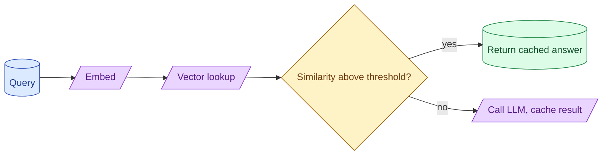

Semantic caching embeds the incoming query, checks if a sufficiently similar one was answered recently, and returns the cached answer. It can cut bills 30 to 60 percent on chat workloads and zero percent on others. The hard part is the similarity threshold and the staleness policy.



## When semantic caching pays off and when it does not

Semantic caching shines when many users ask similar questions. The 100th user asking "how do I reset my password?" gets the cached answer the first user got.

Wins big on:

- Customer support FAQs.
- Product Q&A where the question space is small.
- Documentation search.

Earns nothing on:

- Personalised content (every answer depends on user state).
- Long-form generation (answers vary too much to be reused).
- Code generation (small input differences mean big output differences).

Before building, run the math on a sample of production queries. If 30% of queries match a similar query within the last day, semantic caching is worth the work.

## Threshold tuning: false positives hurt more than misses

A semantic cache has one tuning knob: how similar is "similar enough."

```
cosine > 0.95:   safe; near-identical queries; ~10% hit rate
cosine > 0.90:   usually safe; semantically close; ~20% hit rate
cosine > 0.85:   risky; meaning may differ; ~30% hit rate
cosine > 0.80:   too loose; false positives common
```

A false positive (returning the wrong cached answer) is much worse than a miss (going to the LLM). The user gets a confidently wrong response.

Start strict (0.95+). Lower the threshold only when you have measured that the cached answers are still right.

Measure regularly. Every week, sample 50 cache hits. Check whether the cached answer matches what the LLM would have produced. If quality holds, you can lower the threshold further.

## Staleness: TTL, content-change invalidation, user-scoped caches

Cached answers can go stale. Three patterns for managing this.

**TTL.** Each cache entry expires after N hours or days. Simple. Fine for content that does not change frequently.

**Content-change invalidation.** When the source content (docs, knowledge base) updates, invalidate all cache entries that referenced it. More work; more accurate.

**User-scoped caches.** Cache per user or per tenant. User A's cache does not pollute user B's experience. Prevents accidental data sharing across users.

A common production setup: TTL of 24 hours, user-scoped, plus invalidation on major doc updates.

```python
def get_cached(query: str, user_id: str) -> Answer | None:
    q_vec = embed(query)
    matches = vector_search(
        q_vec,
        filter={"user_id": user_id, "expires_at": {"$gt": now()}},
        top_k=1
    )
    if matches and matches[0].score > 0.95:
        return matches[0].answer
    return None
```

## Tools and embedding choices for the cache

The cache needs three pieces:

**Embedding model.** A cheap fast embedding. text-embedding-3-small or self-hosted BGE-small. The cache embedding does not need to be the same as your RAG embedding.

**Storage.** Pinecone, Qdrant, pgvector, or a simple Redis with embedding-keyed entries. For small caches (under a million entries), Redis with an in-process FAISS index is fine.

**Eviction.** LRU plus TTL. Once the cache exceeds a size limit, oldest entries go first.

```python
class SemanticCache:
    def __init__(self, max_size=10000, ttl_hours=24):
        self.store = {}
        self.index = FaissIndex(dim=1536)
        self.max_size = max_size
        self.ttl_hours = ttl_hours

    def get(self, query: str) -> str | None:
        q_vec = embed(query)
        results = self.index.search(q_vec, k=1)
        if results and results[0].score > 0.95:
            entry = self.store[results[0].id]
            if entry.expires_at > datetime.now():
                return entry.answer
        return None

    def put(self, query: str, answer: str):
        if len(self.store) >= self.max_size:
            self._evict_oldest()
        entry_id = str(uuid.uuid4())
        self.store[entry_id] = CacheEntry(query, answer, expires=now() + timedelta(hours=self.ttl_hours))
        self.index.add(embed(query), entry_id)
```

50 lines for an in-process semantic cache. Scale up to a managed vector DB when needed.

## Measuring cache hit rate vs answer quality

Two metrics that move together but matter separately.

**Hit rate.** What fraction of queries are served from cache. Higher = lower cost.

**Hit quality.** When the cache hits, is the cached answer still correct? Lower = silent quality regression.

Sample cache hits weekly. For each sampled hit, also call the LLM with the same input. Have a judge compare. If hits and fresh answers agree 95%+ of the time, the cache is healthy. If lower, tighten the threshold or shorten the TTL.

A common mistake is to celebrate a 40% hit rate without checking quality. Half of those hits might be wrong.

## Exact-match caches: simpler, often enough

A simpler alternative: cache by exact query match (hash the query string).

```python
def cached_call(query: str) -> str:
    key = hashlib.sha256(query.strip().lower().encode()).hexdigest()
    cached = redis.get(key)
    if cached:
        return cached
    answer = llm_call(query)
    redis.setex(key, 3600, answer)
    return answer
```

Lower hit rate (users rarely phrase queries identically), but zero false positives. For some workloads, this is sufficient.

If your exact-match hit rate is 5-10%, semantic caching might push it to 30-40%. The trade is more code and more risk.

## Common mistakes

- **Caching everything by default.** Personalised content gets shared across users.
- **Threshold too low.** False positives erode quality silently.
- **No staleness policy.** Cached answers go wrong as content changes.
- **Same embedding model as your RAG.** Cache reads slow down because they share embedding budget.
- **No quality measurement.** Hit rate looks great; hits are wrong.

## Quick recap

- Semantic caching reuses answers for similar queries. Big win on FAQ-style workloads.
- Threshold matters: false positives hurt more than misses. Start strict.
- Staleness: TTL, content-change invalidation, user-scoped caches.
- Cheap embedding model plus a vector store, evict on LRU + TTL.
- Measure both hit rate and hit quality. Quality regressions are silent without sampling.
- Exact-match caching is simpler and often enough.

This concept sits in **Stage 6 (Production AI systems)** of the [AI Engineering Roadmap](/practice/ai-engineering/roadmap/).
