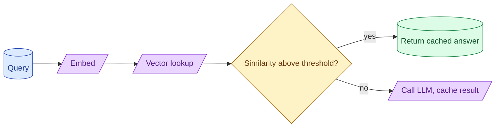

Semantic caching embeds the incoming query, checks if a sufficiently similar one was answered recently, and returns the cached answer. It can cut bills 30 to 60 percent on chat workloads and zero percent on others. The hard part is the similarity threshold and the staleness policy.

**What this page will cover.**

- When semantic caching pays off and when it does not
- Threshold tuning: false positives hurt more than misses
- Staleness: TTL, content-change invalidation, user-scoped caches
- Tools and embedding choices for the cache
- Measuring cache hit rate vs answer quality

*Page coming soon.*

This concept sits in **Stage 6 (Production AI systems)** of the [AI Engineering Roadmap](/practice/ai-engineering/roadmap/).
