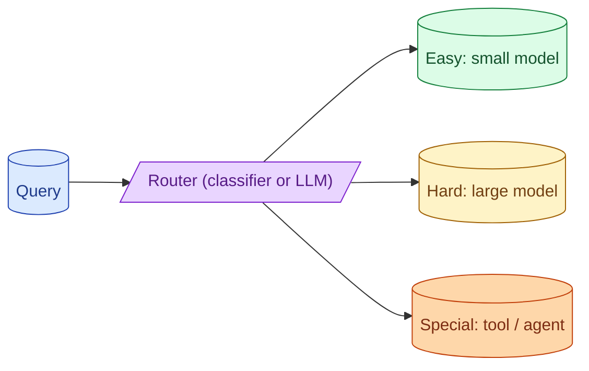

Most queries do not need the biggest model. A small classifier (or even a simple heuristic) routes easy queries to a cheap model and hard ones to a smart model. This is one of the highest-ROI patterns in 2026. The router itself becomes a product surface that needs its own evaluation.

**What this page will cover.**

- The cost-quality dial and where routing fits
- Heuristic vs classifier vs LLM-based routers
- Measuring router accuracy as a first-class metric
- Fallback when the small model fails
- Routing across providers, not just within one

*Page coming soon.*

This concept sits in **Stage 6 (Production AI systems)** of the [AI Engineering Roadmap](/practice/ai-engineering/roadmap/).
