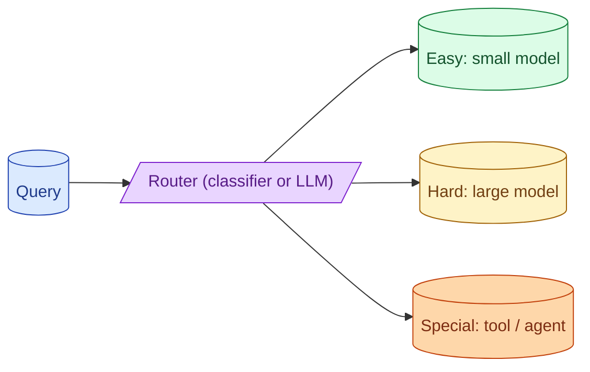

Most queries do not need the biggest model. A small classifier (or even a simple heuristic) routes easy queries to a cheap model and hard ones to a smart model. This is one of the highest-ROI patterns in 2026. The router itself becomes a product surface that needs its own evaluation.



## The cost-quality dial and where routing fits

Every model is a point on a cost-quality curve. Big models cost 10-30x what small ones cost. The quality lift is often only 10-20%.

For the queries where small models work, paying for the big one is waste. For the queries where small models fail, the big one earns its price.

A router separates the two. The result:

```
Without routing:  every query → big model:    $$$$ , high quality
With routing:     80% → small, 20% → big:     $$ , similar quality
```

Total cost drops 60-70% on typical chat workloads. Total quality stays close to "big model on everything" because the hard queries still get the big model.

The router is the cheapest infrastructure piece with the largest cost impact.

## Heuristic vs classifier vs LLM-based routers

Three implementation choices, increasing in complexity and cost.

**Heuristic.** Rules in code. Token count, presence of keywords, query type detected by regex.

```python
def heuristic_router(query: str) -> str:
    if len(query) < 50 and not contains_code(query):
        return "small"
    if "analyze" in query.lower() or "compare" in query.lower():
        return "large"
    return "medium"
```

Free, fast, transparent. Often catches 70-80% of the routing decision correctly.

**Classifier.** A small fine-tuned model trained on labelled examples. Each query gets a category; the category maps to a model.

```python
classifier = load_model("router-classifier-v1")
def classifier_router(query: str) -> str:
    return classifier.predict(query)
```

Better accuracy than heuristics. Costs a small inference per call. Needs training data and retraining as patterns drift.

**LLM-based router.** A small cheap LLM call that classifies the query.

```python
def llm_router(query: str) -> str:
    resp = small_model.classify(query, options=["simple", "complex", "code"])
    return {"simple": "haiku", "complex": "sonnet", "code": "opus"}[resp]
```

Most flexible. Costs a small model call. Easy to evolve (change the prompt instead of retraining).

For most teams in 2026, an LLM-based router using a small model is the sweet spot: cheap, accurate, easy to maintain.

## Measuring router accuracy as a first-class metric

A bad router is worse than no routing. If the router sends hard queries to the cheap model, quality drops. If it sends easy queries to the expensive model, cost rises.

Measure routing accuracy.

```python
def evaluate_router(eval_set: list[tuple]) -> dict:
    correct_route = 0
    cheap_misses = 0  # easy query incorrectly routed to expensive
    expensive_misses = 0  # hard query incorrectly routed to cheap
    for query, expected_class in eval_set:
        actual = router(query)
        if actual == expected_class:
            correct_route += 1
        elif expected_class == "easy" and actual == "hard":
            cheap_misses += 1
        else:
            expensive_misses += 1
    return {
        "accuracy": correct_route / len(eval_set),
        "cost_inflation": cheap_misses,
        "quality_loss": expensive_misses,
    }
```

The two failure modes are not equal. Quality loss (hard query to cheap model) is often worse than cost inflation (easy query to expensive model). Bias the router toward escalating when uncertain.

## Fallback when the small model fails

The router is not perfect. Sometimes a query that looks easy turns out to be hard.

Two patterns for catching this.

**Confidence threshold.** The small model returns a confidence score with its answer. If confidence is below a threshold, re-route to the big model.

```python
def with_fallback(query: str) -> str:
    answer = small_model.call(query)
    if answer.confidence < 0.7:
        return big_model.call(query)
    return answer
```

**Validation pass.** The small model answers. A cheap validator checks the answer. If invalid (wrong shape, refusal, low groundedness), re-route to the big model.

Both add an extra call on uncertain queries. They cost some money but protect quality on edge cases.

## Routing across providers, not just within one

Most teams think of routing within one provider (Haiku vs Sonnet vs Opus). Routing across providers adds another dimension.

```python
def cross_provider_router(query: str) -> tuple[str, str]:
    category = classify(query)
    if category == "code":
        return ("anthropic", "claude-3-7-sonnet")
    elif category == "long_context":
        return ("google", "gemini-2-pro")
    elif category == "general":
        return ("openai", "gpt-4o-mini")
```

Cross-provider routing also gives you failover (concept 58). When one provider is down or slow, the router can switch.

The cost: more abstraction, more SDK code, more monitoring. Usually worth it for production-grade systems.

## A practical setup

For a chat product handling 100,000 queries per day:

- Heuristic gate first (super-cheap pre-filter).
- LLM-based router using Haiku-class model for queries that pass the heuristic.
- Three tiers: small (Haiku, GPT-4o-mini, Flash), medium (Sonnet, GPT-4o), large (Opus, GPT-4.5).
- Confidence-based fallback from small to medium.
- Logged routing decisions for the dashboard.

Average cost per call drops from "everyone on large" to roughly 1/4 with similar quality. The router itself costs maybe 2% of the savings.

## Common mistakes

- **No router because "it adds complexity."** Costs much more than the complexity does.
- **Router but no measurement.** Quality regressions go unnoticed.
- **Treating quality loss and cost inflation as equal.** They are not; bias toward quality.
- **Routing only within one provider.** Misses failover and cross-provider strengths.
- **Heuristic router only, no LLM router.** Misses subtle cases.

## Quick recap

- Model routing cuts cost 60-70% with minimal quality impact.
- Three implementations: heuristic (free), classifier (trained), LLM-based (flexible). LLM-based is the sweet spot.
- Measure router accuracy. Quality loss is worse than cost inflation.
- Add a confidence or validation fallback for misrouted queries.
- Cross-provider routing adds failover. Worth the extra abstraction in production.

This concept sits in **Stage 6 (Production AI systems)** of the [AI Engineering Roadmap](/practice/ai-engineering/roadmap/).
