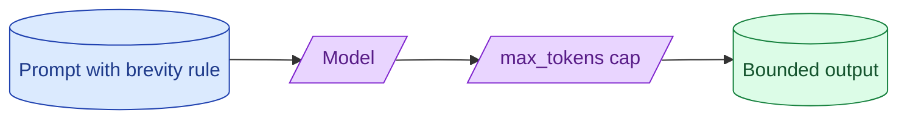

Output tokens cost more than input tokens and a long-winded model can blow a budget fast. `max_tokens` is the hard cap. Prompt design is the soft cap. Without both you ship a feature whose worst case is 10x its average case. With both, costs become predictable.



## How max_tokens actually interacts with the request

`max_tokens` tells the provider "stop generating after this many output tokens." It is a hard cap. The model produces no more than this number.

Two things to know about it.

**Cost is bounded by it.** You can predict the maximum cost per call. If `max_tokens = 500` and your output rate is $15/M, the worst case is $0.0075 per call. Predictable budgeting.

**The model does not know about it.** The model writes as if it had unlimited room. If `max_tokens` cuts off mid-sentence or mid-JSON, the output is truncated.

So `max_tokens` controls cost ceiling but not output quality. You need both: the cap for budget, and prompt design for fitting within it.

## Prompt patterns that produce short answers reliably

The system prompt is where you ask for brevity.

```
Respond with the answer only. No preamble. No closing remarks.
Maximum two sentences unless the user explicitly asks for more.
```

Three patterns that work.

**State the format explicitly.** "Respond with a single sentence." "Respond with a JSON object containing one field."

**Forbid filler.** "Do not begin with 'Sure,' 'Here is,' or 'I can help.'" "Do not end with 'Hope this helps!'"

**Set a token budget.** "Respond in under 100 words."

These reduce average output length by 30-50% with no quality loss. The model was producing filler because no one told it not to.

## What happens when output is truncated mid-JSON

If `max_tokens` cuts off in the middle of a JSON object, parsing fails.

```
max_tokens = 200
Output: {"customer": "Sarah", "items": [{"id": 1, "name":  ← truncated
```

`json.loads()` raises. Your code crashes if you do not handle it.

Three responses, ordered by preference.

**Set max_tokens to accommodate the schema.** Look at the largest expected output. Set max_tokens to 1.3x that. Truncation should be rare.

**Detect truncation.** The provider returns `finish_reason: "length"` when truncated. Use this signal.

```python
if response.stop_reason == "max_tokens":
    log.warning("response_truncated", tokens=response.usage.output_tokens)
    return retry_with_higher_cap(prompt, max_tokens * 2)
```

**Use streaming with a state machine.** For very long structured outputs, stream and process incrementally. Truncation is recoverable.

For most cases, sizing max_tokens correctly is enough.

## Per-feature output budgets and how to enforce them

Different features need different output budgets. Classification needs 20 tokens. Chat needs 500. Code generation needs 2000.

Centralise the budgets.

```python
OUTPUT_BUDGETS = {
    "classify_ticket": 20,
    "extract_invoice": 1500,
    "chat_reply": 800,
    "summarise_thread": 300,
    "generate_code": 4000,
}

def call_llm(feature: str, prompt: str) -> str:
    return client.messages.create(
        model=MODEL_FOR[feature],
        max_tokens=OUTPUT_BUDGETS[feature],
        messages=[{"role": "user", "content": prompt}]
    )
```

Now you can see at a glance what each feature can cost in the worst case. Changes to the budget go through review.

This pattern surfaces overgenerous defaults. Features that have been running with max_tokens=2000 because nobody set it are usually fine at 500.

## Detecting the long-tail-output user pattern early

Average output is 200 tokens. Median is 150. The 99th percentile is 1800. The user who sometimes triggers a 1800-token response is your tail.

```sql
SELECT
  feature,
  PERCENTILE_CONT(0.5)  WITHIN GROUP (ORDER BY output_tokens) AS p50,
  PERCENTILE_CONT(0.95) WITHIN GROUP (ORDER BY output_tokens) AS p95,
  PERCENTILE_CONT(0.99) WITHIN GROUP (ORDER BY output_tokens) AS p99,
  MAX(output_tokens) AS max
FROM llm_calls
WHERE ts > now() - interval '7 days'
GROUP BY feature
ORDER BY p99 DESC;
```

Features where p99 is much greater than p50 have a long tail. Investigate. Usually a specific prompt pattern, a specific user input shape, or a model behaviour you can guard against.

The long tail is what blows budgets. Catch it before it bills.

## Cost-aware output design

Some output designs are inherently cheaper than others.

**Bullet list of 3-5 items** costs ~50 tokens.
**Paragraph explaining the same items** costs ~150 tokens.
**Numbered list with explanations** costs ~300 tokens.

For the same information, the cheapest format is bullets. The most expensive is verbose prose.

If your UI displays bullets, ask for bullets. If it displays paragraphs, ask for paragraphs. Asking for paragraphs and rendering bullets is paying for tokens you discard.

## The "be concise" debate

A common system prompt: "Be concise." Does it work?

Yes, but less than people hope. The model interprets "concise" relative to its baseline, which is verbose. "Concise" might cut output by 20%.

What works better: specific instructions. "Respond in one sentence." "Use at most 50 words." "Avoid introduction phrases."

Specific produces specific results. Vague produces vague results.

## Common mistakes

- **No max_tokens.** The default in some SDKs is "unlimited." Worst-case bill is unbounded.
- **max_tokens too small.** Truncation crashes downstream code.
- **Same max_tokens for every feature.** One feature blows up the others' budget.
- **"Be concise" alone.** Vague; weak effect.
- **No long-tail monitoring.** A few users drive most of the bill; you do not know which.

## Quick recap

- max_tokens is the hard cap on output. Costs are predictable with it.
- The model does not know about max_tokens. Truncation can break structured output.
- Prompt for brevity with specific instructions, not vague ones.
- Set per-feature output budgets. Centralise them.
- Monitor p95 and p99 output sizes. Investigate long tails.
- Cost-aware output design matters: bullets are cheaper than prose for the same info.

This concept sits in **Stage 6 (Production AI systems)** of the [AI Engineering Roadmap](/practice/ai-engineering/roadmap/).
