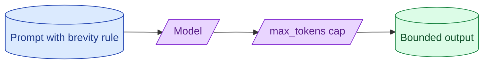

Output tokens cost more than input tokens and a long-winded model can blow a budget fast. `max_tokens` is the hard cap. Prompt design is the soft cap. Without both you ship a feature whose worst case is 10x its average case. With both, costs become predictable.

**What this page will cover.**

- How `max_tokens` actually interacts with the request
- Prompt patterns that produce short answers reliably
- What happens when output is truncated mid-JSON
- Per-feature output budgets and how to enforce them
- Detecting the long-tail-output user pattern early

*Page coming soon.*

This concept sits in **Stage 6 (Production AI systems)** of the [AI Engineering Roadmap](/practice/ai-engineering/roadmap/).
