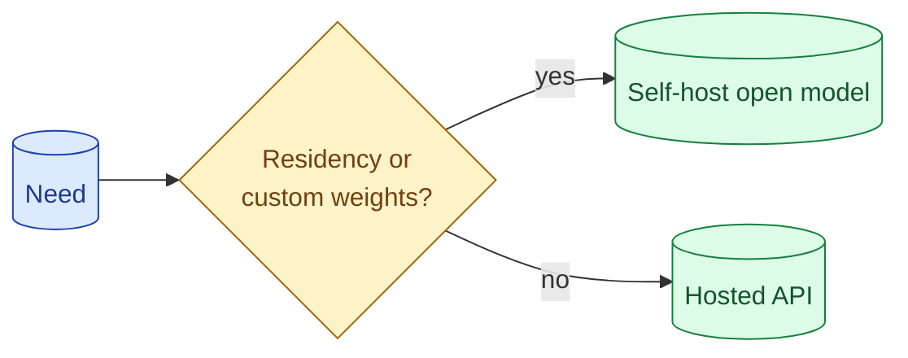

Open-weights models are great, free, and not free. Self-hosting buys you privacy, residency, and customisation. It costs you GPU bills, ops time, and a quality gap to the top closed models. The break-even is at higher volumes than vendors imply and lower than self-hosting evangelists imply.



## What you actually get from open-weights vs hosted

**Open-weights.** You download the model file. You can run it anywhere with enough GPU. You can fine-tune it. You can audit its behaviour. Llama, Mistral, Qwen, Gemma, DeepSeek.

**Hosted (closed).** You call an API. The provider runs the model. You pay per token. Claude, GPT, Gemini-the-API.

The difference is who runs the model and who has access to your data. Everything else (quality, speed, cost, ops) flows from that choice.

## Cost model: GPU rental, utilisation, ops overhead

For self-hosting, the cost has three components.

**GPU rental.** A small Llama 8B can run on a single A10G (~$1/hour). A 70B model needs an H100 ($3-5/hour). A 405B model needs many GPUs.

**Utilisation.** A GPU costs the same whether it serves 1 request per minute or 100 per minute. Below ~30% utilisation, hosted APIs are usually cheaper. At 80%+ utilisation, self-hosting pays off.

**Ops overhead.** Setting up vLLM or TGI, monitoring, scaling, handling OOMs, dealing with model updates. Easily a senior engineer's part-time job.

The honest math, for a 70B open model vs a balanced closed model at 5M tokens/day:

```
Closed API:     5M tokens × $5/M = $25/day = $750/month
Self-hosted:    1 H100 × $3.5/hr × 24 × 30 = $2,520/month
```

At 5M tokens/day, closed wins easily. At 100M tokens/day, the math flips. The crossover depends on your model choice and traffic.

## Quality gap as of 2026 between top open and top closed

The top closed models (Claude Opus, GPT-4.5, Gemini Ultra) still lead the top open models (Llama 3.x 405B, Qwen 2.x, DeepSeek) on most reasoning benchmarks, but the gap is narrower than it was.

For most production tasks (classification, extraction, basic chat, RAG), the top open models are good enough. The closed lead matters for hard reasoning, long context, and specialised domains.

The cheap-tier closed models (Haiku, GPT-4o-mini, Flash) are roughly equivalent in quality to mid-tier open (Llama 8B, Mistral 7B, Qwen 7B). At small scale, the cheap closed APIs are simpler.

## Compliance, residency, audit as the real driver

Cost rarely decides this question. Compliance does.

**Data residency.** Your data must stay in a specific country or region. A US-only API does not serve EU regulated customers. Self-hosting in the right cloud region is sometimes the only path.

**Privacy / no-train commitment.** Some regulations require that your data never enters a third-party training set. Hosted APIs offer opt-outs but the legal team may not trust them.

**Audit.** Some regulated industries require you to know exactly what model is running, that it has not changed silently, and that you can reproduce its behaviour. Open weights give you that. Closed APIs do not.

These are the actual drivers for most self-hosting decisions. Cost is a tiebreaker.

## Hybrid: closed model in front, open model for fallback or specific tasks

You do not have to pick one or the other. Many production systems use both.

**Closed model in front, open model behind.** Closed model handles user-facing chat. Open model runs background batch jobs (cheaper at high volume), embeddings (much cheaper), or specific tasks where it has been fine-tuned.

**Open model in front, closed model for hard cases.** Open model serves the bulk of cheap traffic. Closed model is called when the open model lacks confidence (model routing, concept 50).

**Open model for sensitive data, closed model for general.** PII-touching workloads stay on the open self-hosted model. General queries go to the closed API.

A hybrid stack captures the best of both. The cost is more abstraction and more ops surface.

## Self-hosting tooling in 2026

If you self-host:

**vLLM.** The leading inference engine. Pages of attention, continuous batching. Good throughput. Active development.

**TGI (Text Generation Inference).** Hugging Face's serving stack. Stable, well-documented. Slightly behind vLLM on throughput.

**Ollama.** Local dev and small deployments. Great for prototyping; not production-grade.

**SGLang.** Newer entrant focused on structured outputs and complex prompts.

Most teams pick vLLM. Switch only if you have a specific need (Ollama for local dev, SGLang for advanced features).

## Sizing the GPU

A rough guide.

```
Model size      GPU             Tokens/sec      Concurrent requests
8B              A10G (24GB)     150-300         5-15
70B             H100 (80GB)     60-100          3-10
70B quantized   A100 (40GB)     40-70           2-5
405B            Multi-H100      20-50           1-3
```

These vary with batching, prompt length, and quantisation. Run your own benchmarks before committing.

A good rule: pick the smallest model that meets quality, then size the GPU for your throughput target.

## When closed wins by default

Three cases where closed is almost always the right answer.

**Small team, low volume.** Ops overhead exceeds savings.

**Prototype or new feature.** Move fast, change models often. Self-hosting locks you in.

**Workloads needing the best quality.** The top closed models are still better at the hardest tasks.

Outside these, the question becomes: do you have a compliance need, a volume that justifies the math, or a fine-tuning need that requires open weights? If yes, self-host. If no, hosted API.

## Common mistakes

- **Self-hosting because it sounds cheaper.** At low volume, it is not.
- **Hosted API for PII without a no-train commitment.** Compliance risk.
- **Hybrid stack without a clear boundary.** Both systems get touched, neither is optimised.
- **Skipping benchmarks.** Throughput estimates from blog posts rarely match your workload.
- **Trying to chase the closed quality with the latest open release.** The gap narrows but stays real on hard tasks.

## Quick recap

- Open-weights buys you privacy, residency, customisation, and ops work.
- Closed APIs buy you ease, quality on hard tasks, and no ops.
- Cost crossover is at high volume and high utilisation. Not at small scale.
- Compliance is the usual real driver. Cost is the tiebreaker.
- Hybrid stacks work: closed for chat, open for batch and embeddings. Pick boundaries carefully.

This concept sits in **Stage 6 (Production AI systems)** of the [AI Engineering Roadmap](/practice/ai-engineering/roadmap/).
