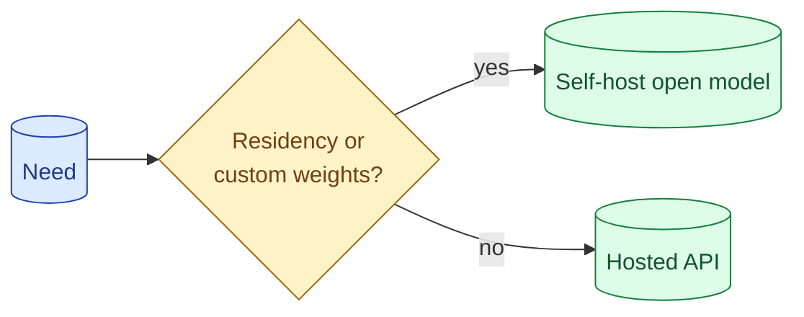

Open-weights models are great, free, and not free. Self-hosting buys you privacy, residency, and customisation. It costs you GPU bills, ops time, and a quality gap to the top closed models. The break-even is at higher volumes than vendors imply and lower than self-hosting evangelists imply.

**What this page will cover.**

- What you actually get from open-weights vs hosted
- Cost model: GPU rental, utilisation, ops overhead
- Quality gap as of 2026 between top open and top closed
- Compliance, residency, audit as the real driver
- Hybrid: closed model in front, open model for fallback or specific tasks

*Page coming soon.*

This concept sits in **Stage 6 (Production AI systems)** of the [AI Engineering Roadmap](/practice/ai-engineering/roadmap/).
