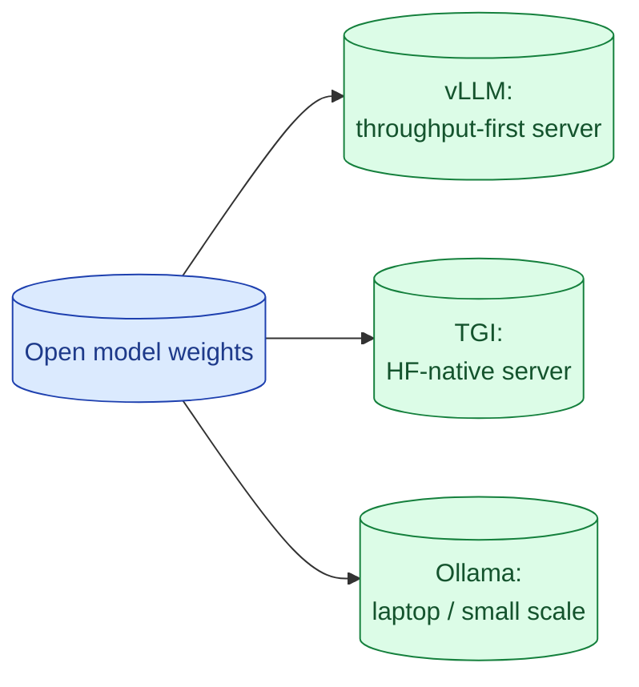

If you decide to self-host, the serving stack matters as much as the model. vLLM is the default for production throughput. TGI is the Hugging Face stack. Ollama is for laptops and small workloads. Each has a different sweet spot and a different operational cost.



## vLLM, TGI, Ollama and what each one is for

**vLLM.** Production server. The leading inference engine in 2026. PagedAttention plus continuous batching make it the throughput leader. Active development, broad model support, OpenAI-compatible API. Use for any serious self-hosting.

**TGI.** Hugging Face's serving stack. Stable, well-tested, widely deployed. Lags vLLM slightly on throughput but ships features faster sometimes. Choose when integration with the rest of HF tooling matters.

**Ollama.** Local development and small workloads. Easy install, easy to run a model on your laptop. Not designed for production throughput. Great for testing models before committing.

**SGLang.** Newer alternative focused on structured outputs and complex prompts. Worth tracking if you do heavy structured output work.

For most teams in production: vLLM. For local dev: Ollama. Skip the rest unless you have a specific need.

## Continuous batching and why throughput collapses without it

A naive LLM server processes one request at a time. Request A arrives, the GPU runs forward passes for A until it is done, then request B starts.

This wastes GPU capacity. Forward passes do not fully use the hardware. The GPU sits partially idle during each request.

Continuous batching changes this. Many requests run together in the same forward pass. When one finishes, another joins. The GPU stays full.

```
Without continuous batching: 1 request at a time, 60 tok/sec
With continuous batching:    8 concurrent requests, 350 tok/sec aggregate
```

A ~6x throughput lift on the same hardware. This is why vLLM and TGI exist and why naive deployments (running a model in a Python loop) are wasteful.

If your serving stack does not do continuous batching, you are paying for GPU time you are not using.

## Quantisation (AWQ, GPTQ, FP8) and the quality tradeoff

A 70B model in full precision (FP16) needs ~140GB of GPU memory. With quantisation, you can run it on much less.

**FP16.** Full precision. Best quality. Most memory.

**FP8.** Half the memory. Quality loss is usually small (1-2%) on most benchmarks. Supported on H100s.

**INT8 (AWQ, GPTQ).** ~1/4 memory. Quality loss is small to moderate (2-5%). Widely supported.

**INT4.** ~1/8 memory. Quality loss is moderate to large (5-15%). Works on much smaller GPUs.

```
70B FP16:    ~140GB    H100 (80GB) does not fit
70B FP8:     ~70GB     fits on one H100
70B INT8:    ~35GB     fits on A100 (40GB)
70B INT4:    ~17GB     fits on RTX 4090 (24GB)
```

Pick the highest precision your GPU budget allows. Quantisation is a quality trade you accept for cheaper hardware.

Quantisation libraries handle this for you. vLLM and TGI support all major formats.

## GPU sizing and the cost-per-token math

A rough cost-per-million-token estimate for self-hosted setups.

```
Setup                                    Cost per Mtok (output)
8B model on A10G (~$1/hr)                 ~$0.05
70B FP8 on H100 (~$3.5/hr)                ~$0.50
70B INT8 on A100 (~$2.5/hr)               ~$0.70
405B multi-H100 (~$15/hr)                 ~$3.50
```

Compare to closed APIs (Sonnet ~$15/Mtok output, Opus ~$75/Mtok output). At sustained high utilisation, self-hosted is dramatically cheaper.

The math assumes the GPU is reasonably utilised. Below 30% utilisation, the dollar-per-token figure becomes much worse.

Run a 1-week benchmark of your actual workload. Measure throughput at your traffic shape. Compute cost per token. Compare to APIs.

## Setting up vLLM in five minutes

```bash
pip install vllm
vllm serve meta-llama/Llama-3-70B-Instruct \
    --tensor-parallel-size 2 \
    --quantization awq \
    --max-model-len 8192
```

That starts an OpenAI-compatible server on port 8000. Your application code can use the OpenAI SDK pointed at this endpoint.

```python
from openai import OpenAI
client = OpenAI(base_url="http://localhost:8000/v1", api_key="not-needed")
resp = client.chat.completions.create(
    model="meta-llama/Llama-3-70B-Instruct",
    messages=[{"role": "user", "content": "Hello"}]
)
```

This is one of the friendliest stories in self-hosting. The OpenAI-compatible API means your code does not need to change to switch backends.

## When a hosted open-weights API is the smart middle ground

You like the open-weights world but do not want the ops. Several providers offer Llama, Mistral, Qwen as a hosted API.

**Together AI, Fireworks, Replicate, Hugging Face Inference Endpoints.** Each serves popular open models with per-token billing.

Pricing is usually lower than the equivalent closed model (because the model is smaller or the provider has different economics). You get the open-weights option without running the GPU.

The trade-off: you do not control where the data goes. If your driver is compliance, hosted open-weights does not solve that. If your driver is cost, it might.

A common path: prototype on hosted open-weights to validate quality, then self-host when volume justifies it.

## Monitoring a self-hosted LLM server

Three numbers to watch.

**Request queue depth.** How many requests are waiting. A growing queue means under-provisioning.

**GPU utilisation.** Target 60-80%. Under means waste; over means rejected requests.

**Time per request (p50, p99).** Watch the tail. Long tails mean someone is sending huge prompts; consider per-request token caps.

vLLM exposes these via Prometheus. Hook them into your existing observability stack.

## Common mistakes

- **Self-hosting without continuous batching.** GPU sits idle; you pay for capacity you do not use.
- **Picking too-aggressive quantisation.** INT4 is fine for some workloads, bad for others. Test before committing.
- **Skipping the benchmark.** Cost-per-token estimates are nothing without your actual workload.
- **Ollama in production.** Not designed for it; will collapse under concurrent load.
- **No monitoring.** Outages start as queue growth; you find out from users.

## Quick recap

- vLLM for production self-hosting. TGI as the alternative. Ollama for local dev.
- Continuous batching is non-negotiable; without it, you waste GPU.
- Quantisation trades quality for memory. FP8 is the modern sweet spot on H100.
- Cost-per-token favours self-hosting at sustained high utilisation. Otherwise, hosted APIs win.
- Hosted open-weights APIs (Together, Fireworks) are a useful middle ground.

This concept sits in **Stage 6 (Production AI systems)** of the [AI Engineering Roadmap](/practice/ai-engineering/roadmap/).
