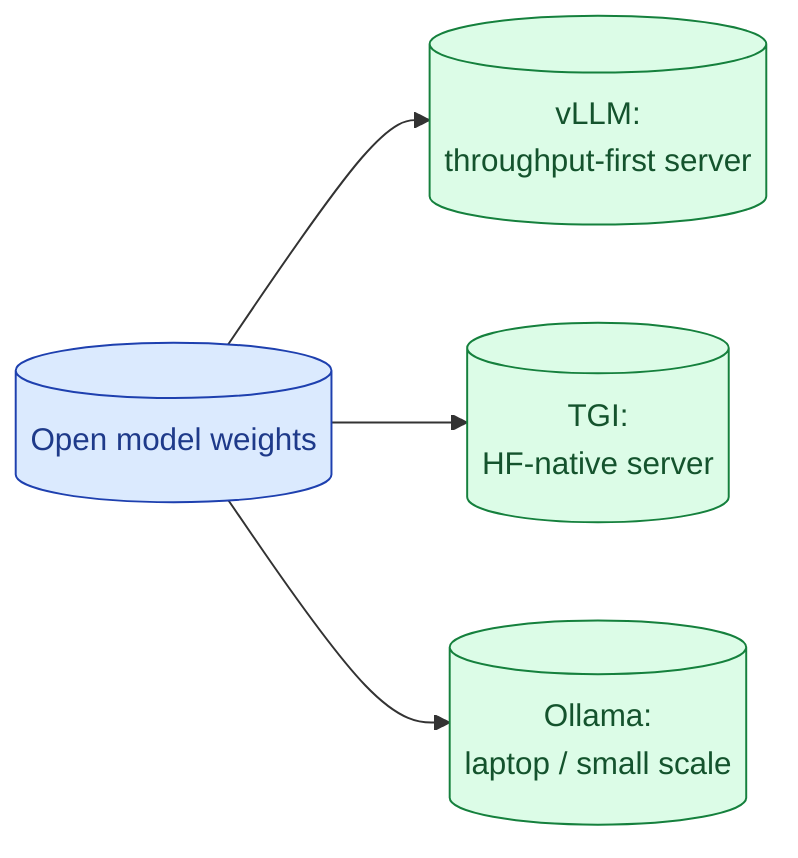

If you decide to self-host, the serving stack matters as much as the model. vLLM is the default for production throughput. TGI is the Hugging Face stack. Ollama is for laptops and small workloads. Each has a different sweet spot and a different operational cost.

**What this page will cover.**

- vLLM, TGI, Ollama and what each one is for
- Continuous batching and why throughput collapses without it
- Quantisation (AWQ, GPTQ, FP8) and the quality tradeoff
- GPU sizing and the cost-per-token math
- When a hosted open-weights API is the smart middle ground

*Page coming soon.*

This concept sits in **Stage 6 (Production AI systems)** of the [AI Engineering Roadmap](/practice/ai-engineering/roadmap/).
