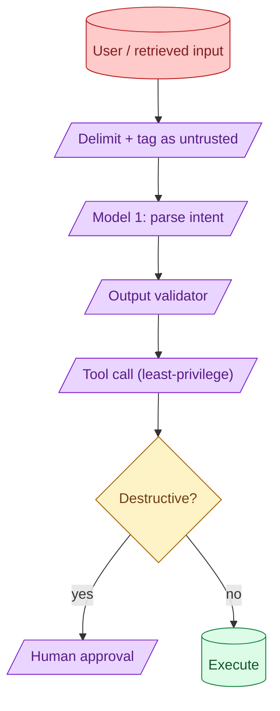

Prompt injection has no single fix. The defence is layered: untrusted-content delimiters, output validation, separate models for parsing vs acting, least-privilege tools, and human-in-the-loop on destructive actions. Each layer catches a different class of attack. Skipping any one of them is how you get embarrassed.

**What this page will cover.**

- Layered defence: no single mitigation is enough
- Tagging untrusted content and what models actually respect
- Dual-LLM pattern: parse with one, act with another
- Least-privilege tool design
- Human-in-the-loop for destructive actions

*Page coming soon.*

This concept sits in **Stage 6 (Production AI systems)** of the [AI Engineering Roadmap](/practice/ai-engineering/roadmap/).
