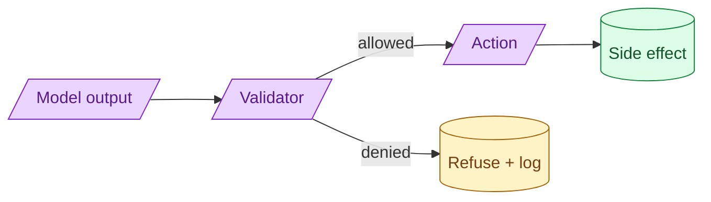

The model can suggest anything. Your code decides what actually happens. Every side-effecting tool needs validation, allow-listing, and (for destructive operations) confirmation. The model's output is input to your validator, not an instruction to your database.



## Why the model is a suggestion, not a command

When the model produces "delete user 42," your code does not have to delete user 42. Your code is the one with database access. Your code decides whether to honour the suggestion.

This framing changes everything. The model is an input source. Inputs need validation. Your validator decides what is allowed.

A bad pattern:

```python
# Trust the model
def handle_agent_action(action):
    if action.type == "delete":
        db.delete(action.id)
```

A good pattern:

```python
# Validate, then act
def handle_agent_action(action, user_session):
    if not is_allowed(action, user_session):
        log_denied(action)
        return error("Action not allowed")
    if not within_safety_bounds(action):
        log_denied(action)
        return error("Outside safety bounds")
    execute(action)
```

Two extra checks. The model's suggestion is filtered through your business logic before any side effect.

## Allow-lists vs deny-lists for tool actions

Two ways to express what is allowed.

**Allow-list.** "These specific actions are permitted." Anything not on the list is denied by default.

**Deny-list.** "These specific actions are forbidden." Anything not on the list is allowed by default.

Allow-lists are safer. New tools, new actions, new model behaviours default to denied. You have to deliberately allow each one.

Deny-lists are leakier. New attack vectors are allowed by default. You react after seeing the problem.

For high-stakes systems, always use allow-lists. The maintenance cost (adding new things to the list as features ship) is real but small compared to the safety margin.

## Two-step confirmation for destructive actions

For irreversible operations (delete, charge, send, modify), the action goes through two stages.

```python
@tool
def delete_records(filter, dry_run=True, confirmation_token=None):
    if dry_run:
        matching = list_matching(filter)
        token = generate_token(filter, matching)
        return {
            "would_delete": len(matching),
            "sample": matching[:5],
            "confirmation_token": token
        }
    if not confirmation_token or not is_valid(confirmation_token, filter):
        return {"error": "Confirmation token required"}
    return execute_delete(filter)
```

The model calls preview. The result includes what would happen and a token. A human reviews. The human grants the token. The model calls confirm with the token.

The human is the brake. Even if the model is trying to do the wrong thing, the human catches it.

For low-stakes operations, you can automate the human step (rate limits, simple rules). For high-stakes, real humans review.

## Logging every action the model attempted, not just the ones that ran

When a validator denies an action, log it. The denial is a signal.

```python
log.info("action_denied", extra={
    "model_action": action.dict(),
    "reason": denial_reason,
    "user_session": user_session.id,
    "timestamp": now()
})
```

Patterns emerge after a week.

- A specific user is repeatedly triggering "send_email" attempts. Suspicious.
- The model keeps trying to delete records with one specific filter. Worth investigating.
- The model is correctly denied for actions a user did not even request. Possible injection.

Without logging the denials, you only see what got through. The denied ones tell you about the attempts.

## How to design tools so the model cannot do harm even on a worst-case output

The pattern: tools should be safe by construction, even if the model produces garbage.

**Read tools.** Make them only read. A read tool cannot delete anything.

**Bounded scope.** A "search messages" tool only searches messages in the user's tenancy. The model cannot search across tenants even if it tries.

**Magnitude caps.** A "send_messages_to_list" tool caps at 100 recipients. The model cannot send to a million.

**Idempotency.** A "create_record" tool with an idempotency key cannot create the same record twice. Retries are safe.

**Audit trail.** Every action records who triggered it (the agent, on behalf of which user, with what input). Audit catches what slipped through.

These are not paranoia. Tools designed this way let you ship agents that take real actions without losing sleep.

## A small layered example

```python
class CreateInvoice(BaseModel):
    customer_id: str
    amount_usd: Decimal = Field(le=10000, gt=0)  # cap at $10k
    description: str = Field(max_length=200)

def safe_create_invoice(model_output: dict, user_session):
    # Layer 1: schema validation (max amount, length)
    try:
        invoice = CreateInvoice.model_validate(model_output)
    except ValidationError as e:
        return {"error": "invalid_invoice", "message": str(e)}

    # Layer 2: allow-list check on customer (must be the user's own customer)
    if invoice.customer_id not in user_session.allowed_customer_ids:
        return {"error": "customer_not_allowed"}

    # Layer 3: rate limit (no more than 5 invoices/min)
    if rate_limit_exceeded(user_session.user_id, "invoice", per_min=5):
        return {"error": "rate_limited"}

    # Layer 4: human approval if amount > $1000
    if invoice.amount_usd > 1000:
        return queue_for_approval(invoice, user_session)

    # All checks passed, execute
    record = create_invoice_record(invoice, user_session)
    log_action(invoice, user_session, record.id)
    return {"success": True, "invoice_id": record.id}
```

Four layers. The model can suggest invoices up to $10k. The validator catches anything outside the user's customer list, anything during rate limit, anything over $1000 without human approval. The damage potential is bounded.

## Common mistakes

- **Trusting model output for side effects.** Validates after the side effect, which is too late.
- **Deny-list for tool actions.** New attack vectors slip through.
- **No two-step confirmation for destructive operations.** One bad call deletes things.
- **No logging of denied actions.** You miss patterns of attempts.
- **Tools with broad scope.** "Update any user" is too dangerous. "Update user X in your tenancy" is safe.

## Quick recap

- The model is an input source, not a command. Validate before acting.
- Allow-list what is permitted; deny everything else by default.
- Destructive actions go through preview + confirmation. Insert humans on high-stakes.
- Log denied actions, not just executed ones. Patterns reveal attacks.
- Tools should be safe by construction: read-only, bounded scope, magnitude caps, idempotency, audit.

This concept sits in **Stage 6 (Production AI systems)** of the [AI Engineering Roadmap](/practice/ai-engineering/roadmap/).
