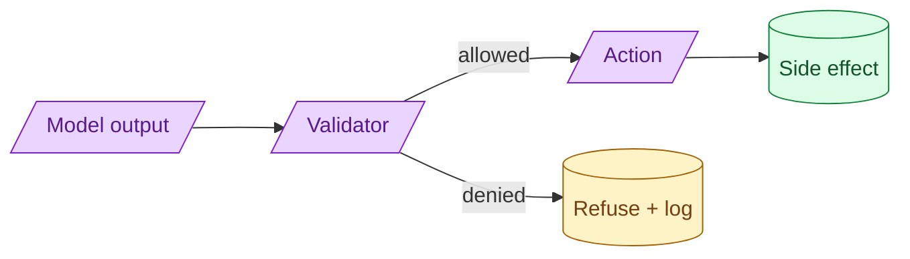

The model can suggest anything. Your code decides what actually happens. Every side-effecting tool needs validation, allow-listing, and (for destructive operations) confirmation. The model's output is input to your validator, not an instruction to your database.

**What this page will cover.**

- Why the model is a suggestion, not a command
- Allow-lists vs deny-lists for tool actions
- Two-step confirmation for destructive actions
- Logging every action the model attempted, not just the ones that ran
- How to design tools so the model cannot do harm even on a worst-case output

*Page coming soon.*

This concept sits in **Stage 6 (Production AI systems)** of the [AI Engineering Roadmap](/practice/ai-engineering/roadmap/).
