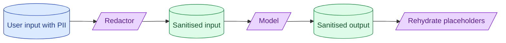

Sending PII to a third-party model has legal consequences. Redaction at the boundary, residency controls on the provider, and a clear separation between what the model sees and what gets logged are the standard pattern. Skipping this work is a GDPR or HIPAA incident waiting to happen.

**What this page will cover.**

- What counts as PII in your jurisdiction
- Redact-and-rehydrate as the standard pattern
- Provider residency: EU, US, on-prem options
- Logging policy: what gets stored, what gets hashed, what gets dropped
- GDPR, HIPAA, and the AI Act in one paragraph each

*Page coming soon.*

This concept sits in **Stage 6 (Production AI systems)** of the [AI Engineering Roadmap](/practice/ai-engineering/roadmap/).
