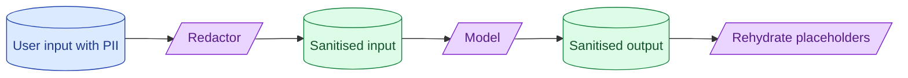

Sending PII to a third-party model has legal consequences. Redaction at the boundary, residency controls on the provider, and a clear separation between what the model sees and what gets logged are the standard pattern. Skipping this work is a GDPR or HIPAA incident waiting to happen.



## What counts as PII in your jurisdiction

PII has different definitions in different places. The conservative working definition:

- **Direct identifiers.** Name, email, phone, government ID, biometric data.
- **Quasi-identifiers.** Date of birth, postcode, employer, IP address.
- **Sensitive attributes.** Health information, sexual orientation, religion, political views, criminal record.

The combination of two quasi-identifiers can identify a specific person. "Born in 1985, lives in Berlin, works at SAP" narrows down to a handful of people.

In the EU (GDPR), PII is broadly defined: anything that could identify a natural person. In the US, definitions vary by state and sector (HIPAA for health, GLBA for financial). Default to "if in doubt, treat it as PII."

## Redact-and-rehydrate as the standard pattern

The pattern: before sending to the model, replace PII with placeholders. After getting the response, swap placeholders back for the real data.

```python
def safe_call(text: str) -> str:
    redactor = Redactor()
    redacted, mapping = redactor.redact(text)
    # redacted: "Email PERSON_001 about the order"
    # mapping: {"PERSON_001": "amirul@example.com"}

    response = model_call(redacted)
    # response: "I will email PERSON_001 about the order."

    final = redactor.rehydrate(response, mapping)
    # final: "I will email amirul@example.com about the order."
    return final
```

The model never sees the PII. It sees placeholders. The placeholders are meaningless to the model but stable, so it can refer back to them.

Three benefits.

The model's logs never contain PII. If logs leak, no real data is exposed.

The model's training data (if used) never sees real PII. Privacy commitment is automatic.

Compliance audit becomes simpler. "We do not send PII to the model" is a defensible statement.

## Provider residency: EU, US, on-prem options

Different providers offer different geographic options.

**OpenAI.** US-based servers by default. Enterprise tier offers some regional options. Azure-hosted OpenAI offers EU residency.

**Anthropic.** Available via Bedrock in many AWS regions, giving residency control.

**Google.** Gemini via Vertex AI, with regional residency.

**Self-hosted open models.** Run anywhere your compliance demands. Full residency control.

For EU regulated workloads, you typically need:

- The model API endpoint is in the EU.
- The provider does not train on your data (most enterprise tiers offer this).
- A signed Data Processing Agreement.

Read the fine print. Some providers have an EU API endpoint but route traffic through the US. Verify with the provider's docs.

## Logging policy: what gets stored, what gets hashed, what gets dropped

Once redacted, what do you log?

**Always log.**

- Request ID, model, timestamp, latency.
- Token counts (input, output).
- Whether the call succeeded.

**Log with redaction.**

- The redacted prompt (placeholders, not raw text).
- The redacted response.

**Log a hash.**

- Of the original user input, if you need to dedup or track repeated queries.

**Never log.**

- Raw PII even from the user-facing UI side.
- The redaction mapping (it links placeholders to real data).

The mapping is held in memory or in a short-lived encrypted store. It is destroyed when the response is sent.

This policy lets you have rich observability without storing data you should not.

## GDPR, HIPAA, and the AI Act in one paragraph each

**GDPR.** EU privacy regulation. Personal data must have a lawful basis for processing. Users have rights to access, correct, delete, and port their data. AI processing of personal data is a higher-risk category requiring stricter controls. Non-compliance: fines up to 4% of global revenue.

**HIPAA.** US health privacy law. Protected Health Information (PHI) requires technical safeguards (encryption, access controls), administrative safeguards (training, policies), and physical safeguards. Sending PHI to a third-party requires a Business Associate Agreement. Major providers offer HIPAA-compliant tiers.

**EU AI Act.** EU-wide AI regulation. Risk-tier classification: prohibited, high-risk, limited risk, minimal. High-risk uses (credit scoring, hiring, healthcare) require risk management, technical documentation, transparency, and human oversight. Effective from 2025-2026 with enforcement phasing in.

For each regulated use case, build the compliance story before you build the feature. Retrofitting compliance is expensive.

## Detecting unredacted PII before it leaves

The redactor catches most PII. It will miss some. Backup detection.

```python
def double_check(redacted_text: str) -> list[str]:
    findings = []
    if re.search(r'\b[\w.-]+@[\w.-]+\b', redacted_text):
        findings.append("possible_email")
    if re.search(r'\b\d{3}-\d{2}-\d{4}\b', redacted_text):
        findings.append("possible_ssn")
    if re.search(r'\b\d{4}\s?\d{4}\s?\d{4}\s?\d{4}\b', redacted_text):
        findings.append("possible_credit_card")
    return findings

leaks = double_check(redacted)
if leaks:
    log.warning("redaction_miss", leaks=leaks)
    redacted = secondary_redact(redacted)
```

If the redactor missed something, the regex catches it. Log the miss so the redactor can be improved.

## Cross-border data transfers

When data moves across borders, additional rules apply.

EU to US: the Data Privacy Framework (replacing Privacy Shield) governs this. Providers signed up to it (most major ones are) can receive EU data legally.

EU to other regions: Standard Contractual Clauses (SCCs) are typically required.

This is lawyer territory, not engineering. Engineering's job: track where the model endpoint physically is, document it, and surface it to the legal team.

## Common mistakes

- **Logging raw user input that contains PII.** Now your log database is in scope for GDPR.
- **No redaction; relying on provider terms.** Provider terms can change; redaction is yours.
- **Same logging policy for redacted and unredacted.** Different sensitivity levels need different policies.
- **Self-hosting but logging the prompts forever.** The model never saw external infrastructure, but your logs still hold the data.
- **Treating compliance as a one-time setup.** Regulations evolve. Review quarterly.

## Quick recap

- Redact PII before sending to the model. Rehydrate placeholders in the response.
- Provider residency matters. Verify where the model API physically is.
- Log redacted text, token counts, latency. Never log raw PII or the redaction mapping.
- GDPR for EU. HIPAA for US health. EU AI Act for high-risk AI uses.
- Detect missed redactions with secondary regex checks. Log misses for improvement.

This concept sits in **Stage 6 (Production AI systems)** of the [AI Engineering Roadmap](/practice/ai-engineering/roadmap/).
