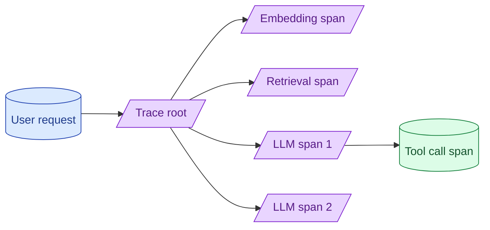

A single user request can fan out to embedding calls, retrieval, multiple model calls, and tool invocations. Without tracing, debugging a slow or wrong answer is guesswork. OpenTelemetry-style spans with prompt, completion, latency, and cost per call is the table stakes setup.

**What this page will cover.**

- What a good LLM span contains
- OpenTelemetry semantic conventions for LLMs
- Tools: LangSmith, Phoenix, Langfuse, Braintrust, Honeycomb
- Correlating cost and quality at the span level
- Sampling strategies for high-volume systems

*Page coming soon.*

This concept sits in **Stage 6 (Production AI systems)** of the [AI Engineering Roadmap](/practice/ai-engineering/roadmap/).
