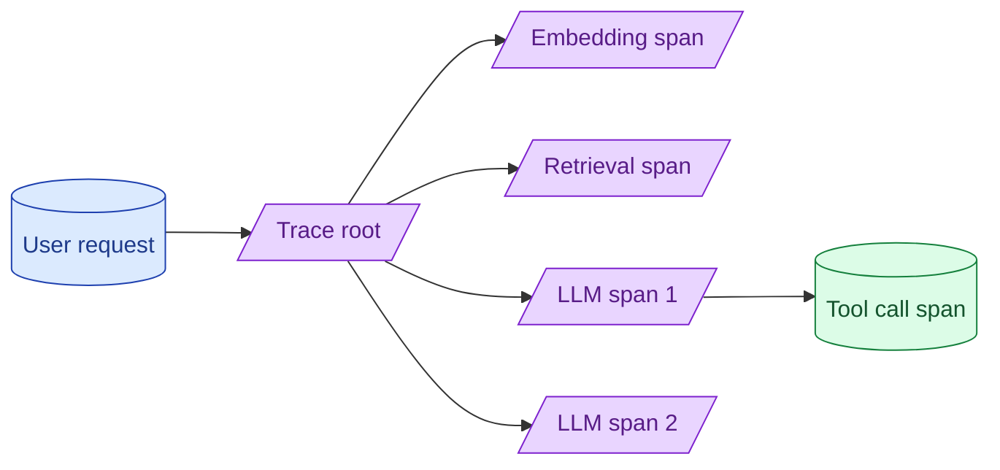

A single user request can fan out to embedding calls, retrieval, multiple model calls, and tool invocations. Without tracing, debugging a slow or wrong answer is guesswork. OpenTelemetry-style spans with prompt, completion, latency, and cost per call is the table stakes setup.



## What a good LLM span contains

A trace is a tree of spans. Each span represents one operation. For an LLM call, the span should include:

```
Span: llm.call
  Attributes:
    llm.provider: anthropic
    llm.model: claude-3-7-sonnet
    llm.prompt: "..." (redacted if needed)
    llm.completion: "..." (redacted if needed)
    llm.input_tokens: 1247
    llm.output_tokens: 384
    llm.input_cost_usd: 0.003741
    llm.output_cost_usd: 0.005760
    llm.cache_read_tokens: 800
    llm.temperature: 0.7
    llm.stop_reason: "end_turn"
    llm.latency_ms: 1247
    llm.ttft_ms: 412
    feature: "summarise_thread"
    user_id: "abc123"  (hashed if needed)
```

A trace with rich spans is debuggable. A trace with just timing is not.

For RAG, also span the retrieval: query, top-K, scores, sources retrieved. For tools, span each tool call with its arguments and result.

## OpenTelemetry semantic conventions for LLMs

The OpenTelemetry project has a draft set of semantic conventions for AI applications. Use them.

```python
from opentelemetry import trace

tracer = trace.get_tracer(__name__)

with tracer.start_as_current_span("llm.call") as span:
    span.set_attribute("gen_ai.system", "anthropic")
    span.set_attribute("gen_ai.request.model", "claude-3-7-sonnet")
    span.set_attribute("gen_ai.request.temperature", 0.7)
    response = client.messages.create(...)
    span.set_attribute("gen_ai.response.model", response.model)
    span.set_attribute("gen_ai.usage.input_tokens", response.usage.input_tokens)
    span.set_attribute("gen_ai.usage.output_tokens", response.usage.output_tokens)
```

The conventions evolve, but the attribute names (gen_ai.*) are stable enough to build on. Using them now means future tooling (better dashboards, vendor migrations) just works.

## Tools: LangSmith, Phoenix, Langfuse, Braintrust, Honeycomb

The 2026 landscape.

**LangSmith.** Hosted. Strong integration with LangChain. Good UI for traces, prompts, and evals together.

**Phoenix (Arize).** Open source, can self-host. Strong tracing UI, weaker on eval management.

**Langfuse.** Open source or hosted. LLM-focused tracing with prompt and cost attribution.

**Braintrust.** Hosted. Polished UI, strong on experimentation tracking, eval-first product.

**Honeycomb / Datadog / New Relic.** General observability platforms with LLM support added in 2025-2026. Use if you already have one of these for the rest of your stack.

For a typical mid-stage team in 2026: Phoenix self-hosted (or Langfuse) for the open-source path. LangSmith or Braintrust for the hosted path. Either works.

## Correlating cost and quality at the span level

Tracing tokens and latency is half the value. The other half is correlating with quality.

Add the eval scores back into the spans after the fact.

```python
def post_process(trace_id: str):
    spans = get_spans(trace_id)
    llm_span = find_llm_span(spans)
    quality_score = run_quality_eval(llm_span)
    annotate_span(llm_span, "eval.quality", quality_score)
```

Now your dashboard can answer: "for which feature is cost-per-quality worst?" The answer is where optimisation pays off most.

This separation (cost in real time, quality from offline eval) is the practical pattern. Doing them together in one call is expensive.

## Sampling strategies for high-volume systems

At 100k+ calls per day, storing every trace becomes expensive. Sample.

**Head-based sampling.** Decide at the start of the trace whether to keep it. Random selection (5-10% of traffic).

**Tail-based sampling.** Keep traces that show problems. Always store: errors, slow requests (>p95 latency), low-confidence outputs.

**Per-feature sampling.** Sample less for high-volume features. Sample 100% for new or critical features for the first month.

A common mix: 5% random sampling, 100% sampling of errors and slow requests. You see the full distribution and have the bad cases for debugging.

## A complete instrumented call

```python
@tracer.start_as_current_span("rag.handle_query")
def handle_query(query: str, user_id: str):
    current_span = trace.get_current_span()
    current_span.set_attribute("user.id_hash", hash_user(user_id))

    # Embed
    with tracer.start_as_current_span("rag.embed") as span:
        q_vec = embed_model.embed(query)
        span.set_attribute("embed.model", "text-embedding-3-large")
        span.set_attribute("embed.dim", len(q_vec))

    # Retrieve
    with tracer.start_as_current_span("rag.retrieve") as span:
        chunks = vector_search(q_vec, top_k=10)
        span.set_attribute("rag.top_k", 10)
        span.set_attribute("rag.chunks_returned", len(chunks))

    # Rerank
    with tracer.start_as_current_span("rag.rerank") as span:
        ranked = rerank(query, chunks, top_k=5)
        span.set_attribute("rerank.model", "rerank-multilingual-v3")

    # Generate
    with tracer.start_as_current_span("rag.generate") as span:
        response = llm_call(query, ranked)
        span.set_attribute("gen_ai.usage.input_tokens", response.usage.input)
        span.set_attribute("gen_ai.usage.output_tokens", response.usage.output)
        span.set_attribute("gen_ai.cost_usd", compute_cost(response))

    return response
```

The trace tree shows each step. Debugging "why was this answer wrong?" becomes "look at the chunks span; what was retrieved?"

## Cost dashboards from traces

Once spans carry cost attributes, build a dashboard.

```
Daily cost by feature
Daily cost by user
Cost per call distribution (p50, p99)
Cache hit rate
Top 10 most expensive single calls today
```

This dashboard tells you where the bill is going. Optimisations target the top items.

A common discovery: one feature uses 60% of total cost. Investigation reveals the prompt is bloated or the model tier is too high. Fix that one thing, save half the budget.

## Common mistakes

- **Time-only tracing.** No prompt, no completion, no tokens, no cost.
- **Logging full prompts when they contain PII.** Compliance leak through observability.
- **Storing every trace forever.** Storage cost balloons.
- **Disconnected eval and traces.** Quality and cost cannot be correlated.
- **No cost dashboard.** Optimisation is guessing.

## Quick recap

- Trace every LLM-touching call. Spans should include model, tokens, cost, latency, key prompt details.
- Use OpenTelemetry gen_ai conventions. Future-proof; vendor-portable.
- Pick one tool for tracing. Phoenix or Langfuse for open source; LangSmith or Braintrust for hosted.
- Sample at high volume. Keep all errors and slow requests; sample successes.
- Correlate cost with eval scores. Optimisation goes to worst cost-per-quality.

This concept sits in **Stage 6 (Production AI systems)** of the [AI Engineering Roadmap](/practice/ai-engineering/roadmap/).
