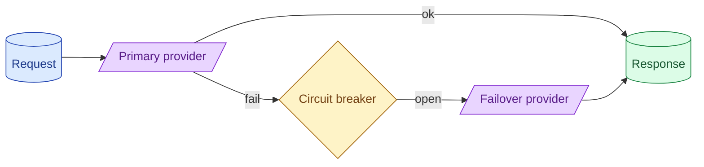

Provider outages happen. A production system needs a failover plan: secondary provider, model fallback, or a graceful 'try again in a minute' for non-critical flows. Circuit breakers stop you from hammering a degraded provider and making everyone's day worse.

**What this page will cover.**

- Failure modes that actually happen with LLM providers
- Same-provider model failover vs cross-provider failover
- Circuit breakers and exponential backoff
- Quality differences across providers: when failover is degradation
- Graceful degradation as a product decision

*Page coming soon.*

This concept sits in **Stage 6 (Production AI systems)** of the [AI Engineering Roadmap](/practice/ai-engineering/roadmap/).
