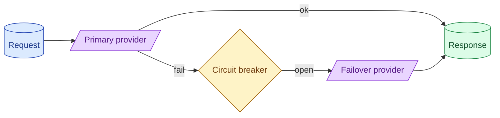

Provider outages happen. A production system needs a failover plan: secondary provider, model fallback, or a graceful 'try again in a minute' for non-critical flows. Circuit breakers stop you from hammering a degraded provider and making everyone's day worse.



## Failure modes that actually happen with LLM providers

The honest list, from frequent to rare.

**Rate limiting (429).** You exceeded RPM or TPM. Common. Handled by retry with backoff (concept 10).

**5xx errors.** Provider hiccup. Transient. Retry with backoff usually fixes.

**Slow responses.** The provider is up but degraded. Latency spikes. Worst because retries make it worse.

**Specific model down.** GPT-4o is having issues; GPT-4 is fine. Same provider, different model.

**Region outage.** US-east is down; other regions are fine. Same provider, different region.

**Full provider outage.** Anthropic is down everywhere. Days happen.

Different fixes for different failures. Plan for each.

## Same-provider model failover vs cross-provider failover

Two failover patterns.

**Same-provider.** Primary is GPT-4. On failure, fall back to GPT-3.5. The model is different (cheaper, faster, lower quality), but the API is the same. Easy to implement.

**Cross-provider.** Primary is Claude. On failure, fall back to GPT. Different API. Requires an abstraction layer. Harder to set up but survives a full Claude outage.

For high-uptime needs, cross-provider is the better answer. The cost is an abstraction layer that hides API differences.

```python
def llm_call(prompt: str) -> str:
    for provider in [primary, secondary, tertiary]:
        try:
            return provider.call(prompt)
        except (TimeoutError, ProviderError):
            continue
    raise AllProvidersDown()
```

The list of providers is ordered by preference. The system tries each in turn until one succeeds.

## Circuit breakers and exponential backoff

A circuit breaker prevents you from hammering a failing provider.

The states:

```
Closed: requests flow normally.
Open:   requests are rejected immediately (no provider call).
Half-open: a few requests are allowed to test if the provider recovered.
```

After N consecutive failures, the breaker opens. Subsequent requests fail fast without calling the provider. After a cooldown, the breaker goes half-open; a few requests test the provider. If they succeed, the breaker closes.

```python
class CircuitBreaker:
    def __init__(self, threshold=5, cooldown=60):
        self.failures = 0
        self.state = "closed"
        self.opened_at = None
        self.threshold = threshold
        self.cooldown = cooldown

    def call(self, fn):
        if self.state == "open":
            if time.time() - self.opened_at > self.cooldown:
                self.state = "half_open"
            else:
                raise CircuitOpen()
        try:
            result = fn()
            self.failures = 0
            self.state = "closed"
            return result
        except Exception:
            self.failures += 1
            if self.failures >= self.threshold:
                self.state = "open"
                self.opened_at = time.time()
            raise
```

50 lines. Saves you from sending 10,000 requests to a dead provider.

## Quality differences across providers: when failover is degradation

A failover to a different model is also a quality change. The Claude-trained prompt may not work as well on GPT.

Two mitigations.

**Prompt portability.** Test your prompts on both providers. Build prompts that work on both. Add small adapter rules per provider where needed.

**Mark degradation in the response.** When you fail over, the user sees an "answered by backup model" badge. Sets expectations.

For some use cases (chat where quality matters), failover should be a last resort. For others (background batch, classification), failover is silent and fine.

## Graceful degradation as a product decision

Sometimes the right answer is to fail gracefully rather than serve degraded output.

```python
def handle_request(query):
    try:
        return llm_call(query)
    except ProviderError:
        return {"status": "degraded", "message": "Try again in a moment."}
```

For a chat product where partial responses confuse users, returning a friendly error is sometimes better than serving a worse answer.

The decision depends on the product:

- **High availability matters more than quality.** Failover and serve.
- **Quality matters more than availability.** Fail gracefully and ask the user to retry.
- **Mixed.** Failover for low-stakes flows; fail gracefully for high-stakes.

This is a product decision, not just engineering.

## Multi-region for the same provider

Some providers offer multi-region failover within their own infrastructure.

OpenAI on Azure can route between regions automatically. Anthropic via Bedrock can use different AWS regions.

For high-uptime workloads on a single provider, regional failover is the cheapest insurance. The API is identical; the only change is the endpoint.

This does not protect against a full provider outage but does protect against regional ones, which are more common.

## Testing failover before you need it

A pattern engineers reliably skip until it bites them: test the failover before production needs it.

```python
# Once a week in a low-traffic window
def chaos_test():
    pretend_primary_is_down()
    run_synthetic_traffic()
    verify_failover_handled_correctly()
    restore_primary()
```

The first time you exercise the failover path should not be during an outage. Build the chaos test. Run it monthly. Find the bugs in your failover code while users are not watching.

## A complete production setup

```python
class LLMClient:
    def __init__(self):
        self.providers = [
            ProviderClient("anthropic", "claude-3-7-sonnet"),
            ProviderClient("openai", "gpt-4o"),
            ProviderClient("google", "gemini-2-pro"),
        ]
        self.breakers = {p.name: CircuitBreaker() for p in self.providers}

    def call(self, prompt: str) -> str:
        for provider in self.providers:
            breaker = self.breakers[provider.name]
            try:
                return breaker.call(lambda: provider.call_with_retry(prompt))
            except (CircuitOpen, ProviderError):
                continue
        raise AllProvidersDown()
```

Three providers, three circuit breakers, per-provider retries. Single function call from the application's perspective. Survives an Anthropic outage cleanly.

## Common mistakes

- **No failover plan.** Provider outage = total downtime.
- **Retry forever on a dead provider.** Makes it worse for everyone.
- **Cross-provider failover without prompt testing.** Quality silently drops.
- **No chaos testing.** Failover code has bugs you discover at the worst time.
- **Silent failover.** Users get surprised by quality changes; trust erodes.

## Quick recap

- Plan for: rate limits, 5xx, slow responses, specific model down, region outage, full provider down.
- Same-provider failover is easy; cross-provider survives more outages.
- Circuit breakers prevent hammering a dead provider.
- Test prompt portability across providers; quality varies.
- Chaos test before you need it. Failover code has bugs.

This concept sits in **Stage 6 (Production AI systems)** of the [AI Engineering Roadmap](/practice/ai-engineering/roadmap/).
