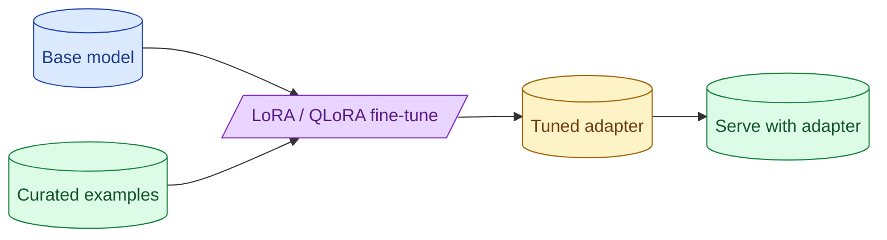

Fine-tuning is a power tool that solves a narrow class of problems: style adherence, format consistency at scale, latency-sensitive small-model deployment. It does not add knowledge well (that is RAG's job). LoRA and QLoRA make it cheap. Synthetic training data is tempting and dangerous.

**What this page will cover.**

- When fine-tuning actually helps (style, format, small-model speed)
- Why it does not help for adding facts (that is RAG)
- LoRA, QLoRA, full fine-tune: cost and quality differences
- The synthetic-data trap: model collapse and bias amplification
- Eval before, during, and after: never ship a tune you cannot measure

*Page coming soon.*

This concept sits in **Stage 6 (Production AI systems)** of the [AI Engineering Roadmap](/practice/ai-engineering/roadmap/).
