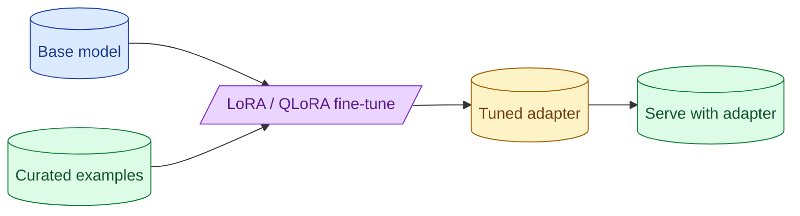

Fine-tuning is a power tool that solves a narrow class of problems: style adherence, format consistency at scale, latency-sensitive small-model deployment. It does not add knowledge well (that is RAG's job). LoRA and QLoRA make it cheap. Synthetic training data is tempting and dangerous.



## When fine-tuning actually helps (style, format, small-model speed)

The three cases fine-tuning earns its complexity.

**Style adherence.** You want the model to write in a specific voice, with specific formatting, every time. A few-shot prompt gets you 80% there; fine-tuning closes the gap.

**Format consistency at scale.** Production classification or extraction where structured outputs and few-shot are not enough. The model is wrong 2% of the time; fine-tuning drops it to 0.2%.

**Small-model speed and cost.** You want a small fast model that performs like a big one on your specific task. Fine-tuning lifts a 7B model from 60% accuracy to 90% on a narrow task, while serving 10x faster than the big model.

These are real. Outside these cases, fine-tuning usually does not help.

## Why it does not help for adding facts (that is RAG)

A common misconception: fine-tune the model on the company knowledge base so it "knows" your product.

This does not work well. Fine-tuning is good at adjusting the model's behaviour. It is bad at making the model remember facts reliably. The model will hallucinate the wrong product name even after fine-tuning on the right one a thousand times.

The right tool for "the model needs to know facts" is RAG. Retrieve the relevant document; the model answers from it.

```
Need to add knowledge?       Use RAG.
Need to change behaviour?    Maybe fine-tune.
```

The line between knowledge and behaviour is fuzzy. The honest test: if a user could find the answer by reading one document, RAG is right. If the right answer requires the model to consistently behave in a specific way, fine-tuning might help.

## LoRA, QLoRA, full fine-tune: cost and quality differences

Three flavours of fine-tuning, in increasing weight and decreasing accessibility.

**LoRA (Low-Rank Adaptation).** Adds small trainable adapter layers to a frozen base model. Training updates only the adapters (millions of parameters, not billions). Adapter files are tiny (10-100MB). Cheap to train and easy to swap.

**QLoRA.** LoRA on a quantised base model. The base is INT4 or INT8; the adapter is FP16. Even cheaper memory; can train a 70B model on a single H100. Quality is usually 1-2% worse than LoRA on FP16.

**Full fine-tune.** Update all model weights. Most expensive, sometimes slightly better quality. Requires significant GPU resources. Rarely worth it over LoRA for most use cases.

For most teams in 2026: LoRA on an open model is the right starting point. QLoRA if you need a bigger model with constrained hardware.

## A typical fine-tuning setup

```python
from peft import LoraConfig, get_peft_model
from transformers import AutoModelForCausalLM, AutoTokenizer
import torch

base = AutoModelForCausalLM.from_pretrained("meta-llama/Llama-3-8B-Instruct")
tokenizer = AutoTokenizer.from_pretrained("meta-llama/Llama-3-8B-Instruct")

lora_config = LoraConfig(
    r=16,
    lora_alpha=32,
    target_modules=["q_proj", "v_proj"],
    lora_dropout=0.1
)
model = get_peft_model(base, lora_config)

# Train on your dataset
train_dataset = load_dataset("path/to/your.jsonl")
trainer = SFTTrainer(
    model=model,
    args=TrainingArguments(...),
    train_dataset=train_dataset
)
trainer.train()
model.save_pretrained("adapter_v1")
```

A few hours of training on a single GPU. Result: a tiny adapter that can be loaded onto the base model at serving time.

Hosted options exist too (OpenAI fine-tuning API, Anthropic does not offer it as of 2026). They abstract the training infrastructure away.

## The synthetic-data trap: model collapse and bias amplification

Tempting pattern: generate training data using a bigger model, then fine-tune a smaller one on that data.

```
1. Use GPT-4 to generate 10,000 question-answer pairs.
2. Fine-tune Llama 8B on those pairs.
3. Deploy the fine-tuned Llama.
```

This works to some degree. The smaller model learns the patterns of the bigger one. Cheaper to serve, similar behaviour.

Two real risks.

**Model collapse.** Training on synthetic data trains the model to be more like the data-generating model. After enough generations, the model loses diversity and drifts toward an averaged-out style. The model becomes "GPT in style only," missing the things GPT does well.

**Bias amplification.** Any bias in the generating model is now in the training set, then in your fine-tuned model. If GPT-4 is overly cautious, so is your Llama tune.

The mitigations: mix synthetic data with real human-curated data; sample diverse outputs (temperature variation); fine-tune for a limited number of epochs; eval rigorously against real human-labeled tasks.

Synthetic data is useful for bootstrapping. Treat it as a starting point, not the only training set.

## Eval before, during, and after: never ship a tune you cannot measure

Without eval, fine-tuning is faith.

**Before.** Measure the base model on your eval set. This is your baseline.

**During.** Track eval metrics on a held-out validation set every N steps. Stop training when validation stops improving (early stopping).

**After.** Run the full eval suite on the tuned model. Compare to baseline. Quality up? Ship. Quality down on some metric? Investigate.

```python
def train_with_eval(model, train_data, eval_data, baseline_score):
    for epoch in range(max_epochs):
        train_epoch(model, train_data)
        score = evaluate(model, eval_data)
        if score < best_so_far:
            patience -= 1
            if patience == 0:
                break
        else:
            best_so_far = score
            patience = max_patience
    final_score = evaluate(model, full_eval)
    assert final_score >= baseline_score, "Tune is worse than base, refuse to ship"
```

The "do not ship a worse tune" check seems obvious but teams skip it. Some tunes train to lower loss on the training set while doing worse on the real eval.

## Cost of fine-tuning

For a Llama 8B LoRA fine-tune:

```
Training:    1 hour × $1/hr GPU = $1
Eval:        ~$5 in eval calls
Total:       ~$6 per training run
```

Cheap experiments. You can run dozens before something works.

For a Llama 70B LoRA:

```
Training:    8-24 hours × $3.5/hr H100 = $30-$80
Eval:        ~$10
Total:       ~$40-$90 per training run
```

Still affordable. Compare to closed model API costs at scale.

Hosted fine-tuning (OpenAI) is more expensive per training run but easier to set up.

## When NOT to fine-tune

The honest list.

**You have not tried prompting well.** Most "I need fine-tuning" projects turn out to be solvable with better prompts.

**You have no eval set.** Cannot measure if it worked. Skip until you have one.

**Less than 100 high-quality examples.** Need more than that for LoRA to do meaningful learning.

**The task changes monthly.** Each tune is a fresh training run. Use prompts; iterate faster.

**You want the model to "know" your product.** RAG, not fine-tuning.

Outside these blockers, fine-tuning may help. Run it as an experiment.

## Common mistakes

- **Fine-tuning before exhausting prompting.** Usually solvable with prompts.
- **Synthetic data only.** Bias amplification; quality plateau.
- **No eval.** Cannot tell if the tune is better.
- **Training too long.** Overfitting; tune memorises noise.
- **Fine-tune to add facts.** Wrong tool; use RAG.

## Quick recap

- Fine-tuning helps with style, format consistency, and small-model speed.
- It does not help with adding factual knowledge; that is RAG.
- LoRA is the default. QLoRA for big models on small hardware. Full fine-tune rarely.
- Synthetic data is a starting point, not the whole training set. Mix with real.
- Eval before, during, and after. Refuse to ship a tune that does worse than the base.

This concept sits in **Stage 6 (Production AI systems)** of the [AI Engineering Roadmap](/practice/ai-engineering/roadmap/).
