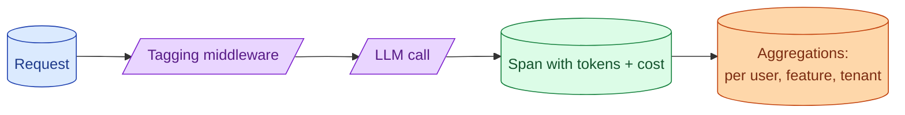

A monthly bill from a provider tells you nothing actionable. A per-request, per-user, per-feature cost number tells you everything. Building this attribution early is cheap. Building it after a budget surprise is painful and incomplete.



## What tags every LLM call should carry

Every LLM call should be tagged with the dimensions you want to slice costs by.

```python
def call_llm(prompt: str, *, feature: str, user_id: str, tenant_id: str = None, model: str = "default"):
    response = client.messages.create(model=model_for(model), messages=...)
    log_cost({
        "ts": now(),
        "feature": feature,
        "user_id": hash(user_id),
        "tenant_id": tenant_id,
        "model": response.model,
        "input_tokens": response.usage.input_tokens,
        "output_tokens": response.usage.output_tokens,
        "cost_usd": compute_cost(response),
        "cache_read_tokens": response.usage.cache_read_input_tokens,
    })
    return response
```

The tags drive everything downstream. Forgetting one tag means you cannot slice that dimension later without re-instrumenting.

Build the tagging wrapper once. Every LLM call in your codebase goes through it. No raw model calls in business logic.

## Per-user vs per-feature vs per-tenant attribution

Three slicing dimensions, each useful for different questions.

**Per-user.** Who is using the most? Identifies abusive users and free-tier overage. Important for B2C.

**Per-feature.** Which feature costs the most? Where to focus optimisation. Critical for product investment decisions.

**Per-tenant.** Which customer costs the most? Critical for B2B SaaS to ensure pricing covers actual cost.

Build a dashboard with all three.

```sql
SELECT
  feature,
  SUM(cost_usd) AS daily_cost,
  COUNT(*) AS calls,
  SUM(cost_usd) / COUNT(*) AS cost_per_call
FROM llm_calls
WHERE date = CURRENT_DATE - 1
GROUP BY feature
ORDER BY daily_cost DESC;
```

Run this daily. Surprises become apparent fast.

## Tying cost to revenue or business value

Cost numbers in isolation are not actionable. Cost relative to revenue is.

For a B2B SaaS:

```
Feature: SmartSearch
Daily cost: $250
Customers using it: 120
Cost per customer per day: $2.08
Customer revenue per month: $50 average
SmartSearch cost as % of customer revenue: 4.2%
```

4.2% of customer revenue going to one feature's LLM cost is high. The feature is probably underpriced or under-optimised.

Compare features by this ratio. The features with bad ratios get optimisation attention; the others stay as they are.

This is the conversation finance wants to have. Engineering should provide the numbers.

## Dashboards and alerts on cost-per-active-user

The single most useful dashboard for AI cost: daily cost per active user (DAU).

```
Day 1: $0.32 per DAU
Day 2: $0.34
Day 3: $0.31
Day 4: $1.42  ← what happened?
```

A big jump in cost-per-DAU is your warning. Either users are doing more (good), unit cost increased (bad), or a small set of users is running away (investigate).

Alert when cost-per-DAU exceeds 1.5x the previous-week average. Manual review catches the cause before the month is out.

For features in early access, also track cost-per-DAU per feature. Some features have outlier users; you want to find them.

## Detecting the abusive user before the bill arrives

A single user can drive a lot of cost. The 99th percentile user can be 100x the median.

```sql
SELECT user_id, SUM(cost_usd) AS user_cost
FROM llm_calls
WHERE date = CURRENT_DATE - 1
GROUP BY user_id
ORDER BY user_cost DESC
LIMIT 20;
```

If the top user spent $50 yesterday on a feature that costs $0.10 per call, they made 500 calls. Was that legitimate use, automation, or abuse?

Investigate. Cap per-user volumes if needed. Some products charge for usage above a tier; some throttle; some warn first.

The user-level dashboard is also your defense against accidental loops in your own code. A bug that makes 1000 calls per request shows up here within a day.

## Per-call cost calculation

Compute cost at log time, not in dashboards. The dashboard can change pricing; the historical record should not.

```python
PRICING = {
    "claude-3-7-sonnet": {"input": 3, "output": 15, "cache_read": 0.30},
    "claude-3-7-haiku":  {"input": 0.80, "output": 4, "cache_read": 0.08},
    "gpt-4o":            {"input": 5, "output": 15},
    # All prices per million tokens
}

def compute_cost(usage, model):
    p = PRICING[model]
    cost = 0
    cost += usage.input_tokens * p["input"] / 1_000_000
    cost += usage.output_tokens * p["output"] / 1_000_000
    if "cache_read" in p:
        cost += usage.cache_read_tokens * p["cache_read"] / 1_000_000
    return cost
```

Update PRICING when providers change rates. Log the version of pricing used so historical numbers stay accurate.

## Budget alerts

Set hard budget alerts at the cloud level (Anthropic budget alerts, OpenAI usage limits). These are the last line of defence.

Set soft budget alerts at the application level. "Daily cost projected to exceed X by midnight; investigate."

```sql
-- Trigger if today's projected spend (cost-so-far / hour * 24) exceeds yesterday by 50%
SELECT
  (SUM(cost_usd) / EXTRACT(HOUR FROM now()) * 24) AS projected,
  yesterday_total * 1.5 AS threshold
FROM llm_calls WHERE date = CURRENT_DATE;
```

Soft alerts give you hours of warning. Hard alerts (provider-side) are the safety net if the soft ones are missed.

## Common mistakes

- **No tagging.** A monthly bill is your only signal.
- **Tagging too late.** Adding tags after a surprise means you have no historical attribution.
- **Cost dashboards without revenue context.** "$500/day on feature X" is meaningless without knowing what X earns.
- **No per-user view.** Abusive users go undetected until the month-end bill.
- **No budget alerts.** Overruns silently happen.

## Quick recap

- Tag every LLM call with feature, user, tenant, model.
- Build dashboards for per-feature, per-user, per-tenant cost.
- Compare cost to revenue. Bad ratios indicate optimisation targets.
- Watch cost-per-DAU as the daily heartbeat metric.
- Per-user view catches abuse and accidental loops.
- Both soft (application) and hard (provider) budget alerts.

This concept sits in **Stage 6 (Production AI systems)** of the [AI Engineering Roadmap](/practice/ai-engineering/roadmap/).
