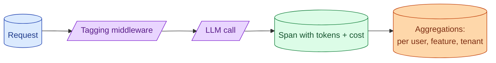

A monthly bill from a provider tells you nothing actionable. A per-request, per-user, per-feature cost number tells you everything. Building this attribution early is cheap. Building it after a budget surprise is painful and incomplete.

**What this page will cover.**

- What tags every LLM call should carry
- Per-user vs per-feature vs per-tenant attribution
- Tying cost to revenue or business value
- Dashboards and alerts on cost-per-active-user
- Detecting the abusive user before the bill arrives

*Page coming soon.*

This concept sits in **Stage 6 (Production AI systems)** of the [AI Engineering Roadmap](/practice/ai-engineering/roadmap/).
