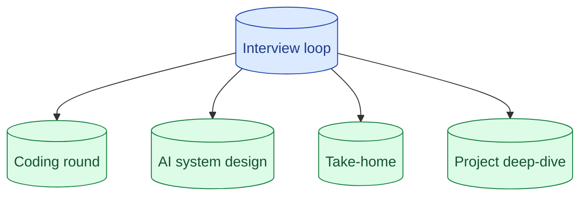

There is no standard AI Engineer interview yet. Four shapes recur: a coding round (often LLM-adjacent), a system design round with an AI lens, a take-home with an eval expectation, and a deep-dive on a past project. Knowing which shape you are walking into changes how you prepare.

## The four recurring shapes in 2026

**Coding round.** Sometimes LeetCode-style, sometimes "build a small thing that talks to an LLM API in 45 minutes." The second flavour is growing. Tests whether you can wire an API call, parse a response, handle errors, write a basic prompt.

**System design.** A traditional system design question with an AI flavour: design a chatbot, a content moderation pipeline, a recommendation explanation generator. Adds dimensions like model choice, cost, latency, eval to the usual scaling and storage discussion.

**Take-home.** A spec arrives by email. You have a week. The deliverable is a working prototype plus a write-up. The good ones include a small eval set. The great ones discuss cost and trade-offs.

**Project deep-dive.** An hour walking through something you have built. The interviewer probes the choices: why this model, how do you know it works, what would you do differently. Senior signal lives here.

Most loops have two or three of these. Few have all four.

## What each shape is actually testing for

**Coding round** tests baseline competence. Can you talk to the API, write defensive code, handle the obvious failures.

**System design** tests how you think about trade-offs. Cost vs quality. Latency vs context. Build vs buy.

**Take-home** tests how you scope a real task. What you choose to build, what you defer, what you measure.

**Deep-dive** tests how you reason about past decisions. Why this, not that. What did you learn. What would you do again.

Each shape has its own mode. A great answer in one shape is a poor answer in another.

## Signal vs noise in vague interviewer feedback

Some interviewer feedback is signal. Some is noise.

**Signal:** "You did not discuss how you would evaluate this." Real gap. Fix it.

**Signal:** "Your cost estimate was off by 10x." Real gap. Practice the math.

**Signal:** "I would have liked to see you push back on the requirements." Real gap. Practice clarifying.

**Noise:** "You did not use LangChain." Often interviewer bias.

**Noise:** "You should have used X model instead of Y." Often interviewer preference, not best practice.

**Noise:** "Your code was not perfectly clean." Coding round has time pressure; readability is enough.

Take signal as input for next time. Discard noise. Vague companies give noise; experienced interviewers give signal.

## Mapping company stage (startup vs big-tech) to expected shape

The interview loop tends to match the company.

**Early startup (pre-Series A).** Probably one or two screens. Heavy on take-home or live coding. The interviewer is often a founder or first AI engineer. Expect informal but probing.

**Mid-stage startup.** Loop of 4-5 rounds. One coding, one design, one take-home, one or two deep-dives. The interview pattern is forming but not standardised.

**Big tech.** Loop of 5-7 rounds. Heavily structured. Often two coding rounds, one system design, one or two AI-specific deep-dives, one behavioural. Less negotiable; more comparable across candidates.

**AI lab / research-flavoured org.** May add a research round (paper discussion, novel-problem design). Niche; less common at engineering-flavoured roles.

Knowing the shape lets you allocate prep time correctly.

## What to ask the recruiter to find out which shape you face

Recruiters expect candidates to ask. Useful questions:

**"Can you walk me through the format of each round?"** Recruiter usually has the breakdown.

**"What is the take-home expected to demonstrate?"** Specific better than "do your best."

**"Is the coding round LeetCode-style or LLM-API style?"** Big difference in prep.

**"Will the system design round have an AI flavour, or is it general?"** Different prep.

**"Who will be interviewing me?"** LinkedIn helps you understand their background.

Recruiters generally appreciate these. They want you to do well; an informed candidate makes their job easier.

## Preparation by shape

**For coding rounds.** Practice the API call patterns. Streaming. Retries. Structured outputs. Build five small projects you can talk through.

**For system design.** Have an outline for RAG, agent, eval pipeline. Drill the canonical answers (see concepts 63, 64, 65).

**For take-homes.** Build a working RAG with a real eval set. Reuse it as your portfolio piece across companies.

**For deep-dives.** Pick two projects. Practice telling each story in 5 minutes, 15 minutes, 30 minutes. Know the numbers (latency, cost, quality lift).

Each shape rewards different preparation. Spread time accordingly.

## Common mistakes

- **Treating every loop the same.** A take-home prep is not a system design prep.
- **No specific questions for the recruiter.** You walk in blind.
- **Over-preparing one round.** Imbalanced loops; weak rounds drag scores.
- **Letting interviewer noise change your foundation.** "They wanted LangChain" is not a reason to change how you build.
- **No project to deep-dive on.** Build one before you start applying.

## Quick recap

- Four shapes in 2026: coding, system design, take-home, deep-dive.
- Each shape tests different things. Prep accordingly.
- Recruiters can tell you the shape; ask.
- Take real feedback as signal; discard interviewer noise.
- Big-tech is structured; startups are informal. Plan for both.

This concept sits in **Stage 7 (Interview craft)** of the [AI Engineering Roadmap](/practice/ai-engineering/roadmap/).
