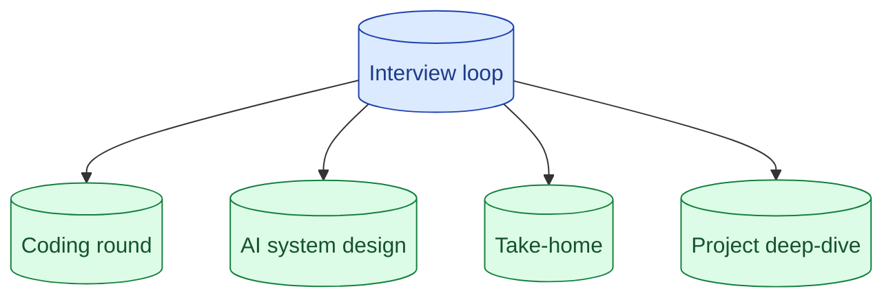

There is no standard AI Engineer interview yet. Four shapes recur: a coding round (often LLM-adjacent), a system design round with an AI lens, a take-home with an eval expectation, and a deep-dive on a past project. Knowing which shape you are walking into changes how you prepare.

**What this page will cover.**

- The four recurring shapes in 2026
- What each shape is actually testing for
- Signal vs noise in vague interviewer feedback
- Mapping company stage (startup vs big-tech) to expected shape
- What to ask the recruiter to find out which shape you face

*Page coming soon.*

This concept sits in **Stage 7 (Interview craft)** of the [AI Engineering Roadmap](/practice/ai-engineering/roadmap/).
