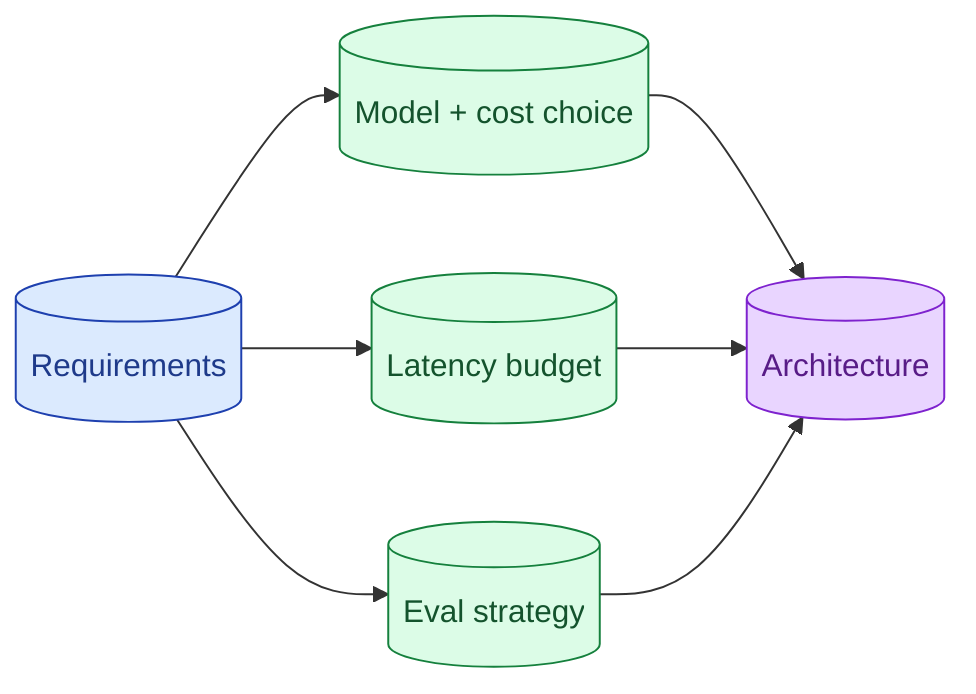

An AI system-design round is a normal system-design round with extra dimensions: model choice, cost per request, latency budget, eval strategy, and failure modes specific to LLMs. The senior signal is naming these dimensions early, not bolting them on at the end.



## The dimensions a normal SD round skips

A standard system design round covers requirements, data model, API, scaling, storage, caching, queueing, failure modes. All still applies for AI systems.

The AI dimensions you add:

**Model choice.** Which model tier handles this task? What is the cost-per-call? What is the quality / latency / cost trade-off?

**Eval strategy.** How do you know the system works? Golden set, judge, in-CI, in-prod.

**Failure modes specific to LLMs.** Hallucination, refusal, drift, prompt injection. What happens when the model is wrong.

**Token budgets.** Context window planning. Output length caps.

A junior answer ignores these. A senior answer brings them up in the first ten minutes.

## Why model and cost choice belongs in the first 5 minutes

Model choice changes the whole design. A 200ms model serves a chat UI; a 5-second model does not. A $0.001 cost model fits a free-tier feature; a $0.10 cost model does not.

Deferring this decision means designing twice. The early commitment lets you make consistent choices throughout.

```
Interviewer: "Design a feature that summarises support tickets."

Junior:      [draws architecture] [10 minutes later] "Oh, we should pick a model."
Senior:      "Quick first question, are these tickets in the 100-500 token range,
              and do we need sub-second response? If so, a small model like
              GPT-4o-mini is around $0.001 per call. If quality matters more
              than cost, Claude Sonnet at $0.005 per call. I will assume the
              first; tell me to reconsider if quality bar is higher."
```

The senior version takes 20 seconds. Names the trade-off, picks a sensible default, invites correction. The rest of the design is internally consistent.

## Talking about evaluation as a design constraint

Eval is not a "we will add tests later" topic. It is a design constraint.

The senior pattern:

```
"For this RAG, I want recall@5 of 85%+ on the golden set in CI. To
get there I need to chunk well, embed with a model that fits the
domain, and use a hybrid + rerank pipeline. If recall@5 is the metric
that decides ship/no-ship, the architecture has to support measuring
it in CI."
```

You named the metric, named the threshold, named the architectural implication. The interviewer sees you treating eval as a design driver.

Skipping this until "oh, we should add eval" at the end is the junior signature.

## Avoiding the LangChain box on the whiteboard

A common junior pattern: draw "LangChain" as a single box covering retrieval, prompting, output parsing, agent logic.

Interviewers know LangChain. Drawing it as one box does not show how the system works. It shows you do not know what LangChain does.

The senior version: draw the actual blocks. Retriever, reranker, prompt template, LLM call, output validator. You can mention "I would use LangChain to wire this up" but the boxes on the diagram represent real responsibilities.

This is one of the cheapest signal-boosters in AI system design rounds.

## Bringing the same rigor you bring to a non-AI design

AI rounds sometimes drift into hand-waving because the field feels new. Resist this.

The same rigor applies.

- **Numbers.** "100,000 users, 5 requests per user per day, each call is ~500 input tokens." Concrete.
- **Calculations.** "At $3/M input tokens, that is $0.0015 per call, $750/day on inputs."
- **Trade-offs named.** "I am choosing Sonnet over Haiku because the eval shows Haiku misses too many cases on this corpus."
- **Failure modes enumerated.** "Provider outage, prompt injection, output schema break, cost spike."

These are the moves you make on a non-AI system design. Make them in the AI round too.

## A canonical structure for an AI system design

A reliable opening sequence.

1. **Clarify the use case.** Who uses it, what does success look like, what is the quality bar.
2. **Estimate the numbers.** Users, requests, average context size, latency target.
3. **Pick the model and discuss cost.** A specific tier with a specific cost-per-call estimate.
4. **Sketch the architecture.** Inputs, retrieval (if needed), model call, outputs, post-processing.
5. **Talk about eval.** Metric, golden set, CI gate, production monitoring.
6. **Failure modes.** Outage, injection, drift, hallucination. Each with a defence.
7. **Scaling.** What changes at 10x traffic. What changes at 100x.

Six minutes per block if you have 45 minutes. Less if more pressed.

This skeleton turns "I do not know what to draw next" into "next block."

## Numbers to memorise

You should be able to recite, without checking, rough figures for:

- Token cost per million (input and output) for the cheap, balanced, big tiers of each provider.
- Embedding cost per million tokens.
- TTFT for small and large models (rough).
- Throughput (tokens/sec) for small and large models.
- Standard chunk sizes (200-800 tokens).
- Standard top-K values (3-10).
- Recall@K targets (80%+ for K=5 on most production RAGs).

A senior knows these like they know a database's query cost. Practice.

## Common mistakes

- **No model choice in the first 10 minutes.** The whole design is unmoored.
- **Eval as an afterthought.** Senior signal demands it as a constraint.
- **LangChain as a box.** Signals you do not know what is inside.
- **Hand-waving on cost.** "Some money" is not an answer.
- **Skipping failure modes.** Most production systems are about failure handling, not the happy path.

## Quick recap

- AI system design adds dimensions: model, cost, eval, LLM-specific failures.
- Pick the model and discuss cost in the first 5 minutes. Sets the consistent design.
- Treat eval as a design constraint, not an add-on.
- Draw actual blocks, not framework names.
- Bring the same rigor (numbers, trade-offs, failure modes) you bring to a non-AI design.

This concept sits in **Stage 7 (Interview craft)** of the [AI Engineering Roadmap](/practice/ai-engineering/roadmap/).
