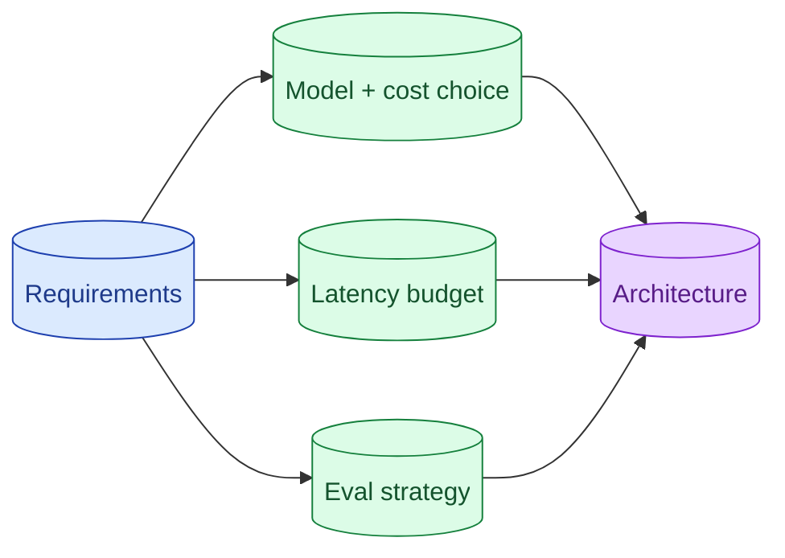

An AI system-design round is a normal system-design round with extra dimensions: model choice, cost per request, latency budget, eval strategy, and failure modes specific to LLMs. The senior signal is naming these dimensions early, not bolting them on at the end.

**What this page will cover.**

- The dimensions a normal SD round skips
- Why model and cost choice belongs in the first 5 minutes
- Talking about evaluation as a design constraint
- Avoiding the LangChain box on the whiteboard
- Bringing the same rigor you bring to a non-AI design

*Page coming soon.*

This concept sits in **Stage 7 (Interview craft)** of the [AI Engineering Roadmap](/practice/ai-engineering/roadmap/).
