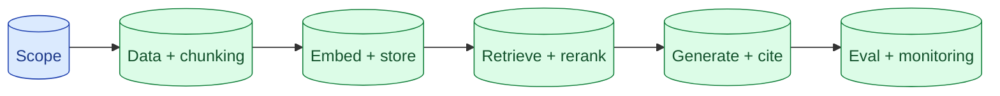

If you can sketch a production RAG system in 45 minutes, end to end, you have the senior signal. The outline is the same every time: scope, data, chunking, embedding, store, retrieval, generation, eval, failure modes, cost. Knowing the outline lets you spend the time on the parts the interviewer cares about.

**What this page will cover.**

- The seven-block outline you can draw in 90 seconds
- Which blocks senior interviewers probe and why
- Numbers to know: chunk size, top-K, embedding cost
- Where to volunteer tradeoffs the interviewer has not asked for
- Common interview RAG prompts and the canonical answers

*Page coming soon.*

This concept sits in **Stage 7 (Interview craft)** of the [AI Engineering Roadmap](/practice/ai-engineering/roadmap/).
