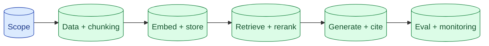

If you can sketch a production RAG system in 45 minutes, end to end, you have the senior signal. The outline is the same every time: scope, data, chunking, embedding, store, retrieval, generation, eval, failure modes, cost. Knowing the outline lets you spend the time on the parts the interviewer cares about.



## The seven-block outline you can draw in 90 seconds

The whiteboard.

```
[Documents] → [Chunker] → [Embedder] → [Vector Store]
                                              ↑
[User query] → [Embedder] → [Retrieval] → [Reranker] → [Generation + cite] → [User]
                                              ↓
                                  [Eval + monitoring]
```

Two flows: ingestion (top) and serving (bottom). They share the embedder and the vector store. Eval observes the serving flow.

This diagram is your anchor. Draw it in the first 90 seconds. Everything else hangs off it.

## Which blocks senior interviewers probe and why

Interviewers do not always probe everything. They probe what you do not volunteer. Knowing where the probes land lets you preempt them.

**Chunking.** "Why 500 tokens? Why overlap?" Senior answer: "Started at 500 because it covers most paragraph-sized concepts; overlap 50 because answers near boundaries get lost without it. I would test 300, 500, 800 on the eval set and pick by recall@5."

**Embedding model.** "Why this one?" Senior answer: name a specific model and justify it. "text-embedding-3-large because it leads on general English benchmarks; I would test bge-large if the corpus has technical jargon, since open-source embeddings often beat closed on niche domains."

**Vector store.** "Why this one?" Senior answer: name a store and justify. "pgvector because we already run Postgres and the corpus is under 10M vectors. Would switch to Pinecone past 50M."

**Reranking.** "Do we need it?" Senior answer: yes, for production RAG. Cohere Rerank or BGE Reranker. The lift from 75% to 88% recall is worth the latency.

**Eval.** Already covered separately, but probed here. Have the answer ready.

**Failure modes.** "What if the answer is not in the corpus?" Senior answer: refuse with "I do not see this in our docs." See concept 36.

If you preempt these, the interviewer cannot trip you up by asking.

## Numbers to know: chunk size, top-K, embedding cost

These are the numbers a senior engineer should rattle off.

```
Chunk size:           200-800 tokens, 500 typical
Chunk overlap:        50-100 tokens
Top-K (first pass):   20-50 candidates
Top-K (after rerank): 3-7 to the model
Recall@5 target:      80%+
Embedding cost:       $0.13/M tokens (text-embedding-3-large)
Vector storage:       ~6KB per chunk (3072-dim)
Reranker cost:        ~$2/1000 search calls (Cohere)
```

Numbers in your head signal "I have built this." Numbers you have to look up signal "I have read about this."

Practice until these come automatically.

## Where to volunteer tradeoffs the interviewer has not asked for

Senior signal is bringing up trade-offs the interviewer has not asked for yet.

After picking the embedding model: "If we expected the corpus to grow past 50M docs, I would also benchmark a smaller dimension for storage cost. Matryoshka representations let us truncate 3072 to 768 with small quality loss."

After picking the vector store: "If we needed strict tenant isolation, pgvector's SQL filters make this much cleaner than a vector DB's metadata filters."

After picking the chunker: "If the corpus had heavy structure (markdown, code), I would use hierarchical chunking instead of token-based."

You are demonstrating depth without being asked. The interviewer sees you considering production realities, not just the assignment.

## Common interview RAG prompts and the canonical answers

**"Design a chatbot that answers questions about our docs."**

Standard RAG. Use the outline. Probe for: how many docs, how often updated, multi-tenant or single.

**"Design a search system for internal knowledge."**

Hybrid (vector + BM25) is the win here. Internal docs have proper nouns and codes that vector alone misses. Reranking is critical because users do many specific lookups.

**"Build a RAG over legal contracts."**

Structural chunking by section. Heavy citations required. Faithfulness eval is non-negotiable. Privacy considerations on retention.

**"Build a RAG that answers from a knowledge base AND web search."**

Two-source retrieval. Treat the knowledge base as primary. Web search as fallback. Citation says which source. Different eval per source.

**"How would you debug a RAG that gives wrong answers?"**

Classify failures: retrieval-side or generation-side. Check recall@K first. If retrieval is right, check faithfulness.

Have these stock answers ready. They free up time for the specific twist the interviewer adds.

## The 45-minute time budget

```
0:00-0:05   Clarify use case, pick model, name cost target
0:05-0:10   Draw the diagram, walk through the flow
0:10-0:20   Deep dive on chunking and embedding (most-probed area)
0:20-0:30   Retrieval, reranking, generation
0:30-0:38   Eval and monitoring
0:38-0:45   Failure modes and scaling
```

If the interviewer pushes hard on one area, the rest gets squeezed. Cover what they care about; you do not need every block to be deep.

## Where most candidates get tripped up

The recurring failure modes in interview RAG design.

**Skipping cost.** Cost-per-call number missing throughout. Junior signal.

**Generic "use a vector DB."** Without a specific pick or justification. Junior signal.

**No reranker.** Or saying "we will add reranking if needed." Reranking is the default in 2026.

**Eval as an afterthought.** Or no eval. Strongest junior signal.

**No failure mode discussion.** What happens when the answer is not in the corpus? Real systems handle this.

Knowing these traps means avoiding them.

## Common mistakes

- **No specific numbers.** "Chunk into pieces" is not an answer; "500 tokens with 50 overlap" is.
- **Drawing one big "Backend" box.** Each block should be a real responsibility.
- **Choosing the most expensive model by default.** Justify the choice against the cost target.
- **Pure vector search.** Hybrid is the default in production.
- **No citation mechanism.** Trust signal is missing from the design.

## Quick recap

- The outline: scope, data, chunking, embedding, store, retrieval, reranking, generation, eval, monitoring.
- Draw the diagram in 90 seconds. Use it as your anchor.
- Know the numbers cold: chunk sizes, top-K, embedding costs, recall targets.
- Volunteer trade-offs the interviewer has not asked for. Demonstrates depth.
- Avoid generic boxes, missing cost, no eval, pure vector search.

This concept sits in **Stage 7 (Interview craft)** of the [AI Engineering Roadmap](/practice/ai-engineering/roadmap/).
