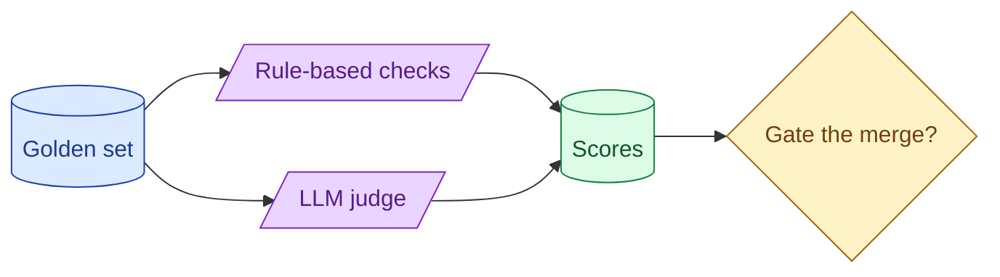

An eval pipeline question separates the AI engineer from the prompt enthusiast. The senior outline: golden set, deterministic checks, judge for the rest, CI gating, A/B in production, and a single headline metric that decides whether the change ships. Anything else is decoration.

**What this page will cover.**

- The pipeline blocks every senior answer has
- Defining the headline metric that decides ship / no-ship
- Golden-set provenance and labelling discipline
- Judge calibration as a separate problem
- Closing the loop from production back to the golden set

*Page coming soon.*

This concept sits in **Stage 7 (Interview craft)** of the [AI Engineering Roadmap](/practice/ai-engineering/roadmap/).
