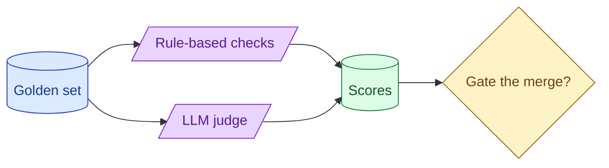

An eval pipeline question separates the AI engineer from the prompt enthusiast. The senior outline: golden set, deterministic checks, judge for the rest, CI gating, A/B in production, and a single headline metric that decides whether the change ships. Anything else is decoration.



## The pipeline blocks every senior answer has

The blocks, in order.

**1. Golden set.** A curated dataset of inputs with expected behaviour. 100-500 examples for most systems.

**2. Rule-based checks.** Deterministic: schema validity, regex match, length, keyword presence.

**3. LLM-as-judge.** For qualitative properties rules cannot express.

**4. Reference-free evals.** Groundedness, refusal correctness, format validity. Run on production traffic without labels.

**5. CI gating.** PRs that drop a metric by more than X block.

**6. Shadow + A/B in production.** Catches what the golden set misses.

**7. Closed loop.** Production failures grow the golden set.

A senior answer hits all seven. Junior answers stop after the third.

## Defining the headline metric that decides ship / no-ship

You have many metrics. One decides.

The headline metric is the one stakeholders agreed on. "Recall@5 must be above 80% to ship." Below that, no merge. Above that, ship.

Other metrics are signals. They inform but do not block.

This discipline matters because without a headline, every regression becomes a negotiation. "Recall dropped, but groundedness went up, so..." With a headline, the decision is clear.

Pick the headline based on what users care about most. For RAG, often recall@K or answer correctness. For agents, often task completion rate. For classification, accuracy on the labelled set.

State the headline up front in your design.

## Golden-set provenance and labelling discipline

Where the golden set comes from matters.

**From production logs.** Sample queries, label them. Best for matching real distribution.

**From hand-written examples.** Cover edge cases and known-hard cases. Best for testing specific behaviour.

**From past bugs.** Every shipped bug becomes a permanent entry. Best for regression prevention.

The senior set mixes all three: 60% sampled production, 30% hand-written hard cases, 10% historical regressions.

Labelling discipline: clear criteria, multiple labellers when possible, documentation of label decisions. A label is a contract between the human and the eval.

## Judge calibration as a separate problem

When the eval uses an LLM judge, the judge itself is a model that can be wrong.

The senior framing: the judge is a separate product. It has its own eval.

Calibration: build a small set of 50-100 examples where you know the correct answer. Run the judge. Compare to human labels. Calculate agreement.

```python
agreement_rate = sum(judge_score == human_score for ...) / total
```

Target 80%+ agreement. Below that, the judge is unreliable. Fix the rubric or pick a bigger judge.

Talking about judge calibration in an interview is a clear senior signal. Most candidates treat the judge as a given. Seniors treat it as a thing they had to validate.

## Closing the loop from production back to the golden set

Production failures are golden-set candidates.

The flow.

```
Production failure detected (user thumbs-down, low groundedness, error).
Engineer reviews the failed example.
If real, add to the golden set with the correct expected behaviour.
Next CI run tests against the new entry.
The bug cannot recur silently.
```

Without this loop, the eval suite calcifies. It tests for yesterday's failure modes while new ones ship.

In the interview, name this loop explicitly. "Every quarter we audit production failures and grow the golden set." Shows you have thought about long-term suite health.

## A complete eval-pipeline answer

In 45 minutes:

```
0:00-0:05  Clarify the system being evaluated. What does success look like.
0:05-0:10  Pick the headline metric. Justify the threshold.
0:10-0:20  Golden set design: provenance, size, labelling discipline.
0:20-0:30  Eval mix: rule-based + judge + reference-free. Where each fits.
0:30-0:38  CI gating + shadow + A/B in production.
0:38-0:45  Closed loop. How the suite grows. Periodic review.
```

This is a recipe. Most candidates skip step 0:05-0:10. Interviewers love when you do not.

## Numbers to know

Like RAG, eval design has its numbers.

```
Golden set starting size:   30-100 examples
Mature golden set:          500-2000
Recall@5 target:            80%+
Groundedness target:        85%+ on production sample
Schema validity target:     99%+
Judge agreement target:     80%+ with humans
CI threshold:               5 percentage points (regression triggers fail)
```

These are starting points. Your specific system may have different targets.

## What separates senior from junior in eval design

Three signals.

**Senior states the headline metric. Junior lists "several metrics."**

**Senior calibrates the judge. Junior trusts the judge.**

**Senior closes the loop from production. Junior treats eval as a one-time setup.**

If you do these three, you stand out.

## Common mistakes

- **No headline metric.** Every regression becomes a debate.
- **Judge without calibration.** Trusting an uncalibrated judge.
- **Eval set never updated.** Calcifies; misses new failure modes.
- **Skipping reference-free evals.** Production blind spot.
- **No CI gate.** Regressions ship; team learns from users.

## Quick recap

- Pipeline blocks: golden set, rules, judge, reference-free, CI, shadow + A/B, closed loop.
- Pick a headline metric that decides ship/no-ship. State it up front.
- Golden set mixes production samples, hand-written hards, past regressions.
- Calibrate the judge against human labels. Target 80%+ agreement.
- Close the loop: production failures grow the golden set.

This concept sits in **Stage 7 (Interview craft)** of the [AI Engineering Roadmap](/practice/ai-engineering/roadmap/).
