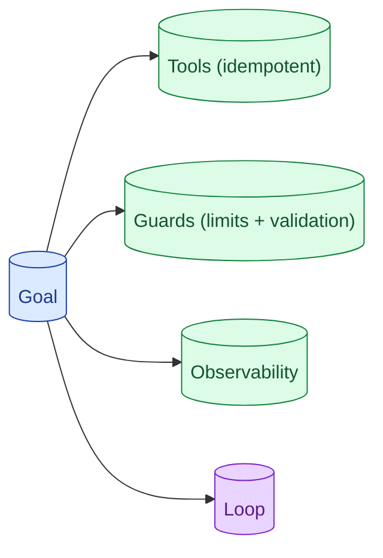

Agent design questions usually surface in interviews as 'build me an X assistant.' The senior outline: tools, guards, observability, the loop itself, then the eval. Most candidates jump to the loop and skip the guards. The guards are what makes the agent safe to ship.



## The four blocks of an agent design

**Tools.** The capabilities the agent can use. Search, calculator, database query, send email. Each one is a well-defined function with a schema.

**Guards.** Limits and validation. Max steps, output validation, allow-list of actions, human approval on destructive ones.

**Observability.** Tracing every step, every tool call, every model decision. Without this, debugging an agent is impossible.

**Loop.** The orchestration: ReAct or similar. Reason, act, observe, repeat.

Most candidates start with the loop. The senior order is: goal → tools → guards → observability → loop. Build the safety net first, then the action.

## Why guards matter more than the loop

The loop is easy. Reason, act, observe. Frameworks provide it.

The guards are what stops the agent from running for an hour, calling expensive tools 50 times, or executing actions outside its scope.

Guards include:

- **Max steps.** The loop cannot exceed N iterations.
- **Output validation.** Every model output is checked before executing.
- **Tool allowlist.** Only specific tools are available; everything else is rejected.
- **Magnitude caps.** "Delete records" capped to 100 at a time, not 1 million.
- **Human approval.** Destructive actions require a token from a human.
- **Cost ceiling.** Per-conversation budget; abort if exceeded.

In an interview, name the guards before the loop. "Before I describe the loop, here are the safety controls I would put around it." This is a senior signal because juniors skip it.

## Designing tools the model can use safely

Tools are the agent's external surface. Bad tools mean bad agents.

A tool design checklist:

**Idempotent.** Calling twice = calling once. Includes idempotency key for side-effecting operations.

**Bounded scope.** "Search user X's documents in tenancy Y" not "search any documents."

**Validating.** Schema enforced; bad arguments rejected with clear error messages.

**Read-only by default.** Write tools are a separate category with extra controls.

**Audit-logged.** Every call records who called, what arguments, what result.

See concept 37 for the full pattern.

In the interview, walk through one tool in detail. "Here is how the 'send_email' tool would work. It validates the recipient. It uses an idempotency key. It refuses calls outside the user's allow-list. It logs every call."

## Observability as a design constraint, not an add-on

Agent runs are non-trivial. A single user request can involve 10 model calls and 5 tool calls. Without tracing, debugging "why did the agent do X?" is impossible.

The senior framing: observability is a design constraint, not added later.

```python
@traced
def agent_step(state):
    with span("plan"):
        plan = model.plan(state)
    with span("act"):
        result = tool.execute(plan.action)
    with span("observe"):
        new_state = update_state(state, result)
    return new_state
```

Every step is a span. Every tool call is a span. Every model call is a span. The trace tree is the full record of what happened.

When the agent does something weird in production, you can replay exactly what it saw and decided.

## How to handle the 'what if it loops forever' question

A classic interview probe.

**Bad answer:** "We will set max_steps to 10."

**Better:** "Max steps as the hard cap, plus detection of progress-less loops."

**Best:** Multiple layers.

```python
def safe_agent_loop(initial_state, max_steps=10, max_cost_usd=1.0, progress_check_interval=3):
    state = initial_state
    last_progress_step = 0
    cost = 0

    for step in range(max_steps):
        action = agent.plan(state)
        cost += estimate_cost(action)

        if cost > max_cost_usd:
            return AgentResult.cost_exceeded(state)

        result = execute(action)
        state = update(state, result)

        if step - last_progress_step > progress_check_interval:
            if not is_making_progress(state):
                return AgentResult.progress_stalled(state)
            last_progress_step = step

    return AgentResult.max_steps_reached(state)
```

Max steps. Cost ceiling. Progress detection. Each catches a different failure.

In an interview, walk through all three. Shows you have thought about real production failure modes.

## A canonical agent design answer

A 45-minute structure.

```
0:00-0:05  Clarify the agent's job. What success looks like.
0:05-0:10  Pick the model and discuss cost-per-run.
0:10-0:20  Tools: list them, walk through one in detail.
0:20-0:30  Guards: max steps, validation, allowlist, human approval.
0:30-0:38  Loop: the ReAct pattern, observability.
0:38-0:45  Eval: how do you know it works.
```

This order is intentional. By the time you describe the loop, the interviewer knows the safety story.

## Common interview agent prompts

**"Design a research assistant."** Open-ended exploration. Multi-step. Tools: web search, file read, summarisation. Tight loop with progress check.

**"Design a customer support agent that can take actions."** Higher stakes. Heavy on guards. Human approval on refunds, escalations.

**"Design a coding agent."** Tools: file read, code execution, search. Iterative. Test after every change.

**"Design a DevOps assistant that can run commands."** Critical guards. Dry-run by default; confirm tokens for execution. Tight observability.

Each has the same outline; the emphasis shifts based on stakes.

## Where most candidates underperform

Three patterns.

**Skipping guards.** Agent design that is just "the loop." Worst signal.

**Overloading the agent.** Giving it 20 tools when 5 would do. Quality drops; cost rises.

**No observability.** Cannot debug agents in production without it.

**Treating "what if it loops" as one question.** Multiple defences answer it; one defence does not.

## Common mistakes

- **Guards as afterthought.** Senior signal is leading with them.
- **One tool listed; rest hand-waved.** Walk through one in real detail.
- **No human-in-the-loop for destructive actions.** Production agents that act on real things need this.
- **No cost ceiling.** Runaway agents bill thousands before noticed.
- **No eval.** "How do we know it works?" goes unanswered.

## Quick recap

- Four blocks: tools, guards, observability, loop. In that order.
- Guards matter more than the loop in real production.
- Tools should be idempotent, scoped, validating, audit-logged.
- Observability is a design constraint, not an add-on.
- Loop safety: max steps + cost ceiling + progress detection.

This concept sits in **Stage 7 (Interview craft)** of the [AI Engineering Roadmap](/practice/ai-engineering/roadmap/).
