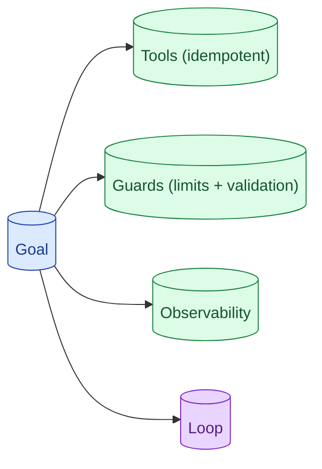

Agent design questions usually surface in interviews as 'build me an X assistant.' The senior outline: tools, guards, observability, the loop itself, then the eval. Most candidates jump to the loop and skip the guards. The guards are what makes the agent safe to ship.

**What this page will cover.**

- The four blocks of an agent design
- Why guards matter more than the loop
- Designing tools the model can use safely
- Observability as a design constraint, not an add-on
- How to handle the 'what if it loops forever' question

*Page coming soon.*

This concept sits in **Stage 7 (Interview craft)** of the [AI Engineering Roadmap](/practice/ai-engineering/roadmap/).
