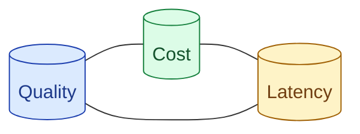

Cost, latency, and quality are one conversation in three voices. A change to one usually shifts the other two. Senior signal is talking about them together: the cheaper model is faster but worse here, the bigger context is slower but the quality lift is worth it. Treating them as separate budgets is junior.

**What this page will cover.**

- The triangle and why it is a triangle
- When to spend cost to buy latency
- When to spend latency to buy quality
- Routing as the cleanest way to break the tradeoff
- Articulating the tradeoff in interviews and design docs

*Page coming soon.*

This concept sits in **Stage 7 (Interview craft)** of the [AI Engineering Roadmap](/practice/ai-engineering/roadmap/).
