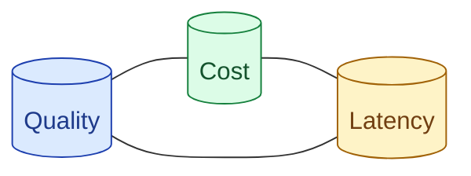

Cost, latency, and quality are one conversation in three voices. A change to one usually shifts the other two. Senior signal is talking about them together: the cheaper model is faster but worse here, the bigger context is slower but the quality lift is worth it. Treating them as separate budgets is junior.



## The triangle and why it is a triangle

Three things you can budget. Pick two; the third is determined.

**Cheap and fast** → quality suffers. Small model handles most things; misses on hard ones.

**Cheap and high quality** → slow. Use the big model but with extensive caching and offline processing.

**Fast and high quality** → expensive. Big model with aggressive parallelism, low cache reliance.

There is no point on the curve where all three are great. The real engineering work is picking the trade-off deliberately.

## When to spend cost to buy latency

User-facing chat with a tight latency budget? Spend more.

Patterns that buy latency:

- **Bigger model with faster inference.** Some providers offer faster tiers.
- **Provider-side prefix caching.** Buys 50-80% latency reduction on cached prefix.
- **Parallel tool calls.** Calls fan out instead of running serially.
- **Speculative decoding.** Big model verifies a small model's drafts. Net latency drops.

Cost goes up. Latency drops. User experience improves.

The trade is right when user-facing latency directly affects conversion (chat, search).

## When to spend latency to buy quality

Batch jobs, content generation, anything offline? Spend latency.

Patterns that buy quality with latency:

- **Bigger model in the slow tier.** Quality lift; users not waiting.
- **Chain-of-thought reasoning.** Doubles token count; correctness on hard tasks doubles.
- **Self-consistency.** Multiple reasoning passes, majority vote. Cost up 3-5x; accuracy up.
- **Reranking with more candidates.** Slow but more precise top results.

Latency goes up. Quality improves. Acceptable when no human is waiting.

The trade is right when the output is later reviewed, batched, or non-interactive.

## Routing as the cleanest way to break the tradeoff

Routing (concept 50) lets you have cost AND quality without trading off latency badly.

```
Easy queries → small fast cheap model.    Most queries.
Hard queries → big slow expensive model.   Few queries.

Average cost: low.
Average quality: high (hard ones get the big model).
Average latency: low (easy ones are fast).
```

The router itself is fast and cheap. The system as a whole optimises across the triangle by routing each query to the right tier.

In an interview, when asked "how would you reduce cost without losing quality?", the answer is often "model routing." Demonstrates that you see all three dimensions.

## Articulating the tradeoff in interviews and design docs

Bad way to talk about it.

```
"We need to reduce cost."
```

Good way.

```
"We need to reduce cost by 60% without dropping recall below 80% or
increasing p99 latency past 3 seconds. The leverage we have:
prefix caching gives us roughly 40% input cost reduction; switching
to a cheaper model gives another 20% but the quality is right at the
boundary; routing 80% of traffic to the cheaper model with the harder
queries staying on the better one threads the needle."
```

Numbers. Constraints. Multiple levers. Specific trade-off named.

This is how senior engineers talk about it. Junior engineers say "we need to reduce cost." Same problem; different signal.

## The triangle in different scenarios

| Scenario | Best lever |
| --- | --- |
| Chat UI feels slow | Streaming + prefix caching |
| Bill is too high | Model routing + smaller default tier |
| Quality dropped after model swap | A/B + rollback + revisit |
| Latency spike at p99 | Investigate large prompts; cap max_tokens |
| Budget cut by 50% | Trim system prompt + model routing |
| New feature with same model unsustainable | Cheaper model + better eval to verify |

Each scenario has its lever. The first move is often not the obvious one.

## When all three trade-offs are real

A reasoning model produces excellent quality but is slow and expensive. Switching to a non-reasoning model brings cost and latency down but quality drops.

The honest answer: pick which axis to prioritise based on the use case.

```
For interactive chat: prioritise latency.   Use the non-reasoning model.
For overnight reports: prioritise quality.  Use the reasoning model.
```

The senior framing: "I am picking latency as the priority here because [reason]. If you tell me quality matters more, I switch to [other choice]."

This is the kind of answer interviewers love. You named the trade-off, justified the priority, and showed flexibility.

## The numbers to know

When discussing cost-latency trade-offs, have these in your head.

```
Small model cost:     $0.25-$1 / M input tokens
Big model cost:       $15-$30 / M input tokens (10-30x more)

Small model latency:  150-300 tok/sec, TTFT <500ms
Big model latency:    30-60 tok/sec, TTFT 1-3s

Cache discount:       50-90% off input tokens
Cache TTFT win:       60-80% lower on cached prefix
```

These let you do rough math live in the interview. Concrete > vague.

## Common mistakes

- **Talking about cost without latency or quality.** One-dimensional.
- **Vague "we'll optimise later."** Senior signal demands a plan.
- **Skipping routing.** It is often the best lever; missing it is a missed signal.
- **Wrong trade-off for the use case.** Optimising for latency on a batch job; quality on a chat UI.
- **No numbers.** Trade-offs without numbers are stories.

## Quick recap

- Cost, latency, quality are one triangle. Pick a position; do not pretend all three are free.
- Spend cost to buy latency for user-facing interactive features.
- Spend latency to buy quality for batch and offline jobs.
- Routing is often the cleanest lever; uses cheap for easy, expensive for hard.
- Articulate trade-offs with numbers, constraints, multiple levers, and a justified priority.

This concept sits in **Stage 7 (Interview craft)** of the [AI Engineering Roadmap](/practice/ai-engineering/roadmap/).
