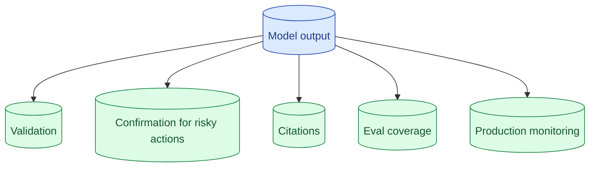

Every senior interview includes 'what if the model returns the wrong answer?' The bad answer is 'we'll tune the prompt.' The good answer is layered: validation at the output, confirmation for destructive actions, citations for traceability, eval to catch the class of failure, monitoring to detect it in production.

**What this page will cover.**

- The five layers of defence against wrong answers
- Why prompt tuning alone is the wrong reply
- Citations as a UX commitment
- Eval coverage for the class of failure
- Monitoring for the patterns evals will not catch

*Page coming soon.*

This concept sits in **Stage 7 (Interview craft)** of the [AI Engineering Roadmap](/practice/ai-engineering/roadmap/).
