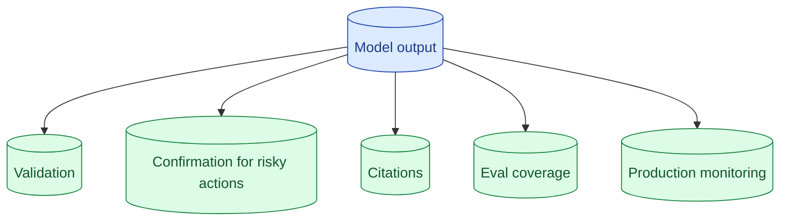

Every senior interview includes 'what if the model returns the wrong answer?' The bad answer is 'we'll tune the prompt.' The good answer is layered: validation at the output, confirmation for destructive actions, citations for traceability, eval to catch the class of failure, monitoring to detect it in production.



## The five layers of defence against wrong answers

The interviewer wants to see that you treat "the model could be wrong" as a design constraint, not an edge case.

**Layer 1: Output validation.** Schema check, value range, allowed values. The output of the model is input to your validator.

**Layer 2: Confirmation for destructive actions.** Anything that cannot be undone goes through a preview + confirm flow. Insert humans for high-stakes.

**Layer 3: Citations and traceability.** Every claim points to a source. Wrong answers become diagnosable.

**Layer 4: Eval coverage for the failure class.** Every kind of failure that can happen gets an eval case. The next regression on it cannot ship silently.

**Layer 5: Production monitoring.** Reference-free evals on production traffic detect drift. Logs allow root-cause analysis.

A senior answer names all five. A junior answer names "we will improve the prompt."

## Why prompt tuning alone is the wrong reply

When interviewers ask "what if the model is wrong?", they are testing whether you understand that prompt tuning is unreliable.

The model can still produce wrong output even after careful tuning. The prompt is one variable; the model's stochastic generation is another. You cannot guarantee correctness through prompting.

The right framing: prompt tuning improves the average case. Layered defence handles the worst case. Both are needed.

"We will tune the prompt" answers half the question. The other half is "and here is what catches the times the prompt was not enough."

## Citations as a UX commitment

Citations (concept 35) are more than a feature. They are a commitment to the user that they can verify the answer.

In an interview, when discussing citations:

"For high-stakes outputs, every claim cites the source. The UI surfaces clickable citations. When the model says 'refunds are 30 days', the user can click [1] and see the exact paragraph that says so."

"What if the model cannot cite?" The answer is honest: "It refuses to answer. 'I do not see this in the documentation' is a feature, not a bug."

This commitment changes the model's behaviour and the user's trust. It is the cheapest hallucination defence.

## Eval coverage for the class of failure

When a wrong answer is found in production, the response is not "fix the prompt." The response is:

1. Add the failing input to the golden set.
2. Add the eval that would have caught the class of failure (groundedness, schema, refusal correctness).
3. Fix the underlying issue.
4. Verify the eval now catches it before merging the fix.

This converts each failure into a permanent regression test. The same class of wrong answer cannot ship again.

In an interview, articulate this loop. "When a customer reports a wrong answer, we add it to the eval. The next deploy has to pass."

## Monitoring for the patterns evals will not catch

Evals run on a known set. Production has a much wider distribution.

Reference-free evals (concept 43) on production traffic catch what the eval set missed.

```
Daily metric: groundedness on 100 sampled production answers.
Daily metric: refusal rate.
Daily metric: schema validity rate.
Alert: any metric drops 5 percentage points.
```

When the alert fires, the engineer investigates. Often a new class of input that the eval set did not cover. The class gets added; the next deploy has it covered.

This is the production observability story for LLM systems. Without it, "the system seems to be getting worse" is the only signal.

## A canonical answer to the interview prompt

```
"For 'what if the model is wrong,' I think of five layers.

First, output validation. Schema checks, value range, allowed values.
Most structural failures get caught here.

Second, confirmation for destructive actions. Preview + confirm with
human review for high-stakes operations. Even if the model is wrong,
nothing irreversible happens automatically.

Third, citations. Every claim in the output points to its source. Wrong
answers become diagnosable. Users can verify.

Fourth, eval coverage. Every failure mode we have seen has a
corresponding eval case. CI catches regressions on known failures.

Fifth, production monitoring. Reference-free evals like groundedness
and schema validity track quality drift on real traffic. Alerts when
metrics drop.

Prompt tuning is upstream of all this. It helps the average case. The
five layers handle the worst case."
```

Two minutes. Comprehensive. The interviewer hears every layer they wanted to hear.

## When the interviewer keeps probing

If they push beyond the five layers, they are testing depth.

"Tell me more about the validation layer."

"For RAG, validation checks that the schema is valid, that citations reference real sources (not invented), that the answer does not contradict the retrieved context. I would run a small judge model on a sample to check faithfulness as a second pass."

"How do you choose the threshold for the production alert?"

"Start with one standard deviation below the historical mean. Tune after seeing false-positive rate."

The depth signals you have actually shipped this.

## Common mistakes

- **"We'll tune the prompt."** Half-answer.
- **One layer only.** "We validate the output" is good but incomplete.
- **No mention of monitoring.** Production blind spot.
- **Reactive not proactive.** "We'll fix bugs as they come up" misses eval coverage.
- **No citation answer for the RAG case.** Specific feature; specific answer.

## Quick recap

- Five layers: validation, confirmation, citations, eval coverage, monitoring.
- Prompt tuning is upstream of these; not a substitute.
- Citations are a UX commitment to verifiability.
- Every shipped failure becomes a permanent regression test.
- Reference-free evals on production catch what the eval set missed.

This concept sits in **Stage 7 (Interview craft)** of the [AI Engineering Roadmap](/practice/ai-engineering/roadmap/).
